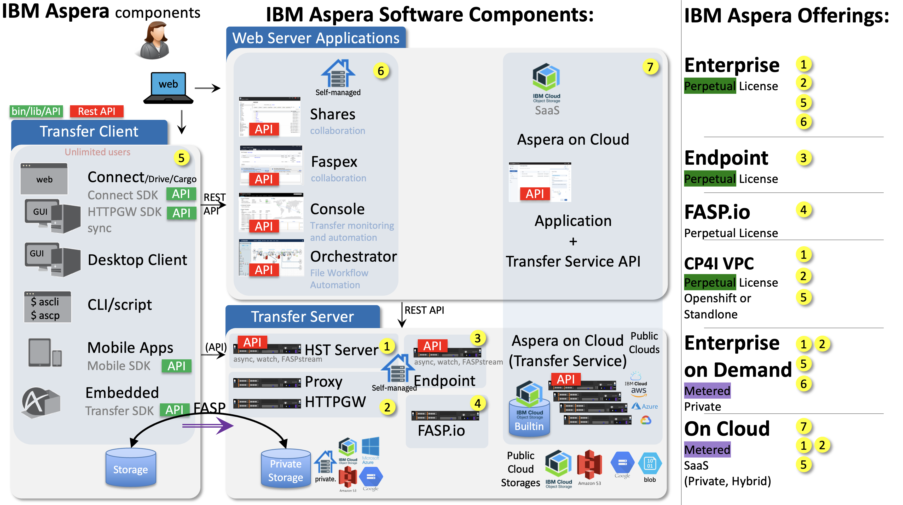

# Aspera API sample apps

[](LICENSE)

Sample code using IBM Aspera APIs for various IBM Aspera products and SDKs:

- Aspera Transfer SDK: transfer files in an application
- Aspera Connect SDK and HTTPGW SDK: transfer files in a web browser
- Aspera Applications APIs: interact with Aspera applications (Faspex, AoC, Node API, COS, etc...)



Various programming languages are proposed.

## Other resources

[IBM Aspera API documentation](https://developer.ibm.com/apis/catalog/?search=aspera) (select 24 items per page on bottom).

[Aspera Transfer SDK documentation](https://developer.ibm.com/apis/catalog?search=%22aspera%20transfer%20sdk%22)
 contains code sample for the use oif it.

[Video about Transfer SDK](https://higherlogicstream.s3.amazonaws.com/IMWUC/d5b91301-6aa1-5741-e083-2a9121d9d8a7_file.mp4)

The [IBM Aspera Connect SDK github site](https://github.com/IBM/aspera-connect-sdk-js) contains examples about using the Aspera Connect SDK.

## Introduction

IBM Aspera provides two types of APIs:

- Client APIs:

  SDKs include **libraries** to be used in applications to transfer files

  - **Aspera Transfer SDK**: (gRPC with multi language) transfer files in an application
  - web SDKs:
    - **Aspera Connect SDK**: (web js) transfer files in a web browser
    - **Aspera HTTP Gateway SDK**: (web js) transfer files in a web browser using HTTPS
    - **Aspera for Desktop**: (web js) transfer files in a web browser

- Server APIs:

  **REST** APIs (with OpenAPI spec) interact with Aspera applications (Faspex, AoC, Node API, COS, etc...)

Depending on the use case, one might use one or (often) several of those APIs.

## Repository structure

This repository is structured like this:

- `web` : This folder contains an example that shows the use of web SDKd: both the **Aspera Connect SDK** and **Aspera HTTP Gateway SDK**

- Other folders, one per programming language, show samples using the **Aspera Transfer SDK** and **Aspera Applications REST APIs**

Sample programs will use server addresses and credentials from a YAML configuration file.
Once the configuration file is created, sample programs can be run directly.

**Unix-like systems**: Linux, macOS... a `Makefile` is provided to run the samples.

**Windows**: Refer to [Quick start (Windows)](#quick-start-windows) below. `make` might not be available. Use the `Makefile` as a reference to execute the commands manually.

## Quick start (Unix-like systems)

If you use Linux, macOS, AIX, etc...

1. Initialize the main folder:

    ```bash
    make
    ```

    This will:

    - Create an empty configuration file from the template.
    - Download the Aspera Transfer SDK.
    - Extract the SDK.

    > **Note:** If you don't have internet access on the system then download the Transfer SDK on a system with internet from: <https://ibm.biz/aspera_transfer_sdk> and place the file here: `<main folder>/generated/trsdk/transfer_sdk.zip`

2. Refer to [Configuration File](#configuration-file): Edit the file `private/config.yaml` and fill values.

    ```bash
    vi private/config.yaml
    ```

3. Run the samples: see [Running sample programs](#running-sample-programs)

## Quick start (Windows)

1. Refer to [Configuration File](#configuration-file): Copy the file `config/config.tmpl` into `private/config.yaml` and fill values.

    ```dos
    md private
    copy config\config.tmpl private\config.yaml
    ```

   Set the parameter `misc.platform` to `windows-x86_64`

   Edit required parameters in `private/config.yaml`, for example Faspex connection information.

   > **Note:** Yes, you can also drag and drop, and click, and copy/paste, and edit the file with Notepad, etc...

2. Prepare the SDK folder

    ```dos
    md generated
    md generated\trsdk
    mklink /D generated\trsdk\etc noarch
    ```

    > **Note:** Creation of the link `etc -> noarch` is because `ascp` will look for its license file `aspera-license` in one of `.` `./etc` `..` `../etc` `../..` `../../etc`

3. Download [sdk.zip](https://ibm.biz/aspera_transfer_sdk) and extract its contents to `generated/trsdk`

4. Run the samples: see [Running sample programs](#running-sample-programs)

## Running sample programs

Create a configuration file as specified in [Configuration file](#configuration-file).
Not all values are required, only those needed for the examples you want to run.

For example to execute an individual sample, use `make .tested/<sample name here>`:

```console
$ cd python
$ make list
server aoc faspex faspex5 node shares node_v2
$ make .tested/faspex5
```

Or run the sample directly (invocation depends on language):

```bash
echo hello > datafile
python python/src/cos.py datafile
```

## Configuration file

A template configuration file is provided: [`config/config.tmpl`](config/config.tmpl).

Copy the file `config/config.tmpl` into `private/config.yaml` and fill with your own server addresses, credentials and parameters.

```bash
cp config/config.tmpl private/config.yaml
vi private/config.yaml
```

> **Note:** Although the format may look like the configuration file for `ascli`, a configuration file for `ascli` is not compatible with this one. You must create a new one.

Set the parameter `misc.platform` to the architecture used:

- `osx-arm64`
- `osx-x86_64`
- `windows-x86_64`
- `linux-x86_64`
- `linux-s390`
- `linux-arm64`
- `linux-ppc64le`
- `aix-ppc64`

The parameter `trsdk.url` can be set to `grpc://127.0.0.1:55002` (specify the local port that sdk will use).

Section `httpgw` is used by the `web` example only.

Other sections are used by the various examples.
For example, if you want to test only the COS transfer using the Transfer SDK, you can fill the `cos` section only and leave other sections empty.

Example (with random credentials):

```yaml
misc:
  platform: osx-x86_64
trsdk:
  url: grpc://127.0.0.1:55002
web:
  port: 9080
httpgw:
  url: https://1.2.3.4/aspera/http-gwy
server:
  user: aspera
  pass: demoaspera
  url: ssh://demo.asperasoft.com:33001
  file_download: /aspera-test-dir-small/10MB.1
  folder_upload: /Upload
node:
  url: https://node.example.com:9092
  verify: false
  user: node_user
  pass: _the_password_here_
  folder_upload: /Upload
faspex:
  url: https://faspex.example.com/aspera/faspex
  user: faspex_user
  pass: _the_password_here_
cos:
  endpoint: https://s3.eu-de.cloud-object-storage.appdomain.cloud
  bucket: my_bucket
  key: _the_key_here_
  crn: 'crn:v1:bluemix:public:cloud-object-storage:global:_the_crn_::'
  auth: https://iam.cloud.ibm.com/identity/token
coscreds:
  bucket: mybucket
  service_credential_file: ./service_creds.json
  region: eu-de
aoc:
  org: acme
  user_email: john@example.com
  private_key: /path/to/my_aoc_key
  client_id: aspera.global-cli-client
  client_secret: frpmsRsG4mjZ0PlxCgdJlvONqBg4Vlpz_IX7gXmBMAfsgMLy2FO6CXLodKfKAuhqnCqSptLbe_wdmnm9JRuEPO-PpFqpq_Kb
  workspace: Default
  shared_inbox: TheSharedInbox
```

> **Note:** Sections with HTTPS URLs have a parameter `verify`. Set it to `false` to disable server certificate validation for development environments.

Some relative paths are defined in [`config/paths.yaml`](config/paths.yaml) (keep those values intact).

## Transfer SDK

The Transfer SDK is a gRPC service that allows you to transfer files in an application.
It is a client API that can be used in various languages.

The file `transfer.proto` describes in the remote procedure call interface provided by the daemon `asperatransferd`.

```text
 +----------------+
 + transfer.proto +
 +----------------+
         |
     [protoc]
         |
         v
    +----------------------+        +------------+
    + generated stub code  +        + your code  +
    +----------------------+        +------------+
              |                            |
              +-----------+----------------+
                          |
                          v
                    +------------+                      +---------------------+
                    | client app |-----[connect to]---->| Transfer SDK daemon |
                    +------------+                      +---------------------+
                          |                                       ^
                          +-------------[executes]----------------+
                                                                  |
        [or other method, systemd, or manual]-----[executes]------+
```

### Generated client source files

Client applications must use the client source files generated from the `transfer.proto` file.

Generated (stub) code is provided for convenience in the Transfer SDK for several languages.
It can be used directly or the developer may choose to generate them from the `transfer.proto` file.
For production and future compatibility it is recommended to generate the stub code from the `transfer.proto` file.
If you generate stub code yourself, then you can benefit from support to latest platforms and versions.

Most samples here generate the stub code from the `transfer.proto` file.

Refer to [GRPC web site](https://grpc.io/) for instructions on how to generate the code.

### Helper classes

Sample programs use helper classes located in package `utils`:

- `Configuration` reads configuration parameters from `config.yaml` so that it is easier to run any samples.
- `TransferClient` creates a configuration file and starting the Transfer SDK daemon: `asperatransferd`
- `Rest` for simple API calls on Rest APIs.

### Daemon startup

`asperatransferd` is a daemon that must be started before using the Transfer SDK.
It drives the transfer of files between two endpoints using embedded `ascp`.
The client app will connect to it using gRPC on the port specified.

The way to start the daemon is not specified in the SDK.
Developers have the choice to start it manually in a separate terminal, or to create a static configuration file and start it using another method (for example, a systemd service).

Examples provided here start the daemon using the `TransferClient` class.

## HSTS Node API credentials

Refer to the [HSTS documentation](https://www.ibm.com/docs/en/ahts/4.4?topic=linux-set-up-hsts-node-api) to create a user and get the credentials.

Typically, a node api user is created like this:

```bash
/opt/aspera/bin/asnodeadmin -a -u my_node_username -p my_node_password -x my_transfer_user
```

> **Note:** Access key credentials (id and secret) can also be used for the node api user.

## Shares

Shares provides the following APIs:

- Transfer related APIs: It is identical to the **Node API**. The root of Shares API for transfers is `<shares url>/node_api`.
- Admin APIs (manage users , etc...)

The same examples as for **Node API** can be used for **Shares**.

## Aspera on Cloud

For Aspera on Cloud, several configuration items are required:

- `org` : The AoC Organization, i.e. the name before `.ibmaspera.com` in the URL
- `user_email` : The user's IBMid
- `private_key` : The path to the PEM file containing the user's private key. The user configured the associated public key in his AoC User's profile.
- `client_id` : (see below) The client app identifier
- `client_secret` : (see below) The client app secret

`client_id` and `client_secret` can be:

- either a specific application credential created in the admin interface of AoC (Integrations)
- or one of the two global client id : the one of aspera connect/drive or the one of the legacy `aspera` CLI :
  - `aspera.global-cli-client`
  - `frpmsRsG4mjZ0PlxCgdJlvONqBg4Vlpz_IX7gXmBMAfsgMLy2FO6CXLodKfKAuhqnCqSptLbe_wdmnm9JRuEPO-PpFqpq_Kb`

For example to extract the ones of Aspera Connect (Drive): `strings asperaconnect|grep -B1 '^aspera\.drive$'`

## COS service credentials

To test transfers to COS, you will need:

- bucket name
- storage endpoint
- api key
- resource instance id (crn)
- authentication endpoint (optional)

This is the default in the example.

Or it is also possible to use:

- bucket name
- region
- service credentials: create the file `private/service_creds.json`, follow: [get service credentials](https://www.rubydoc.info/gems/aspera-cli#using-service-credential-file)
