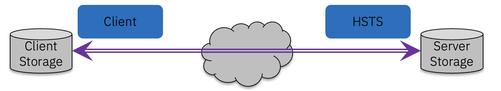
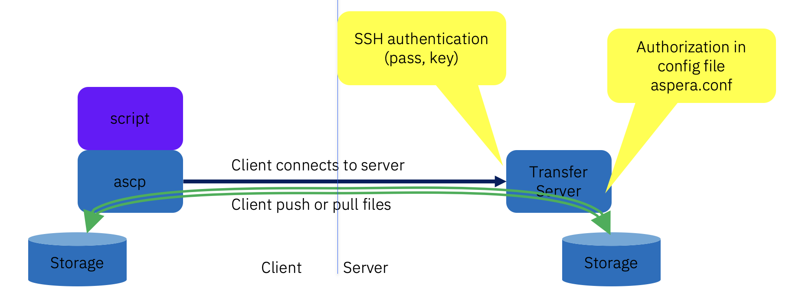
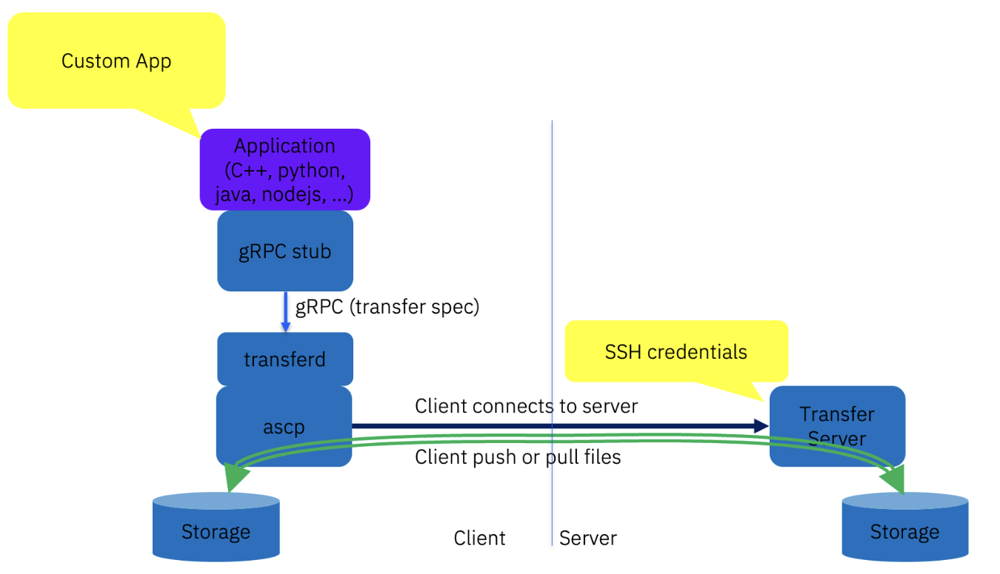
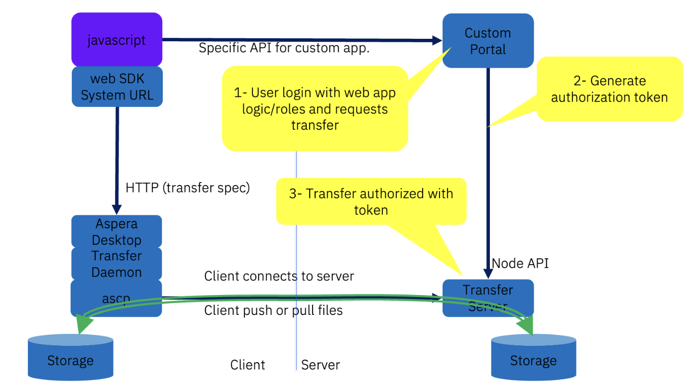
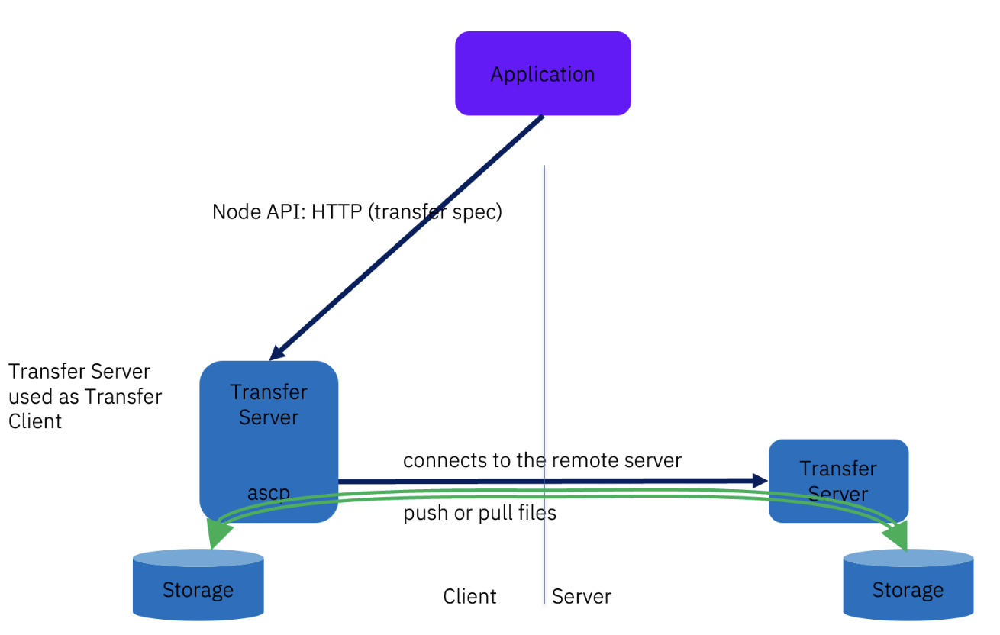
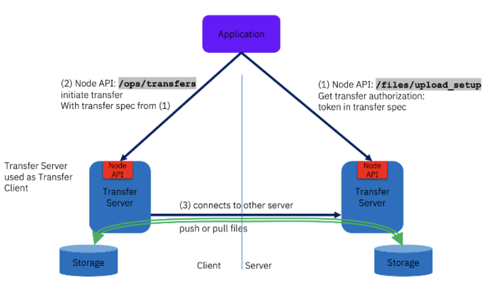
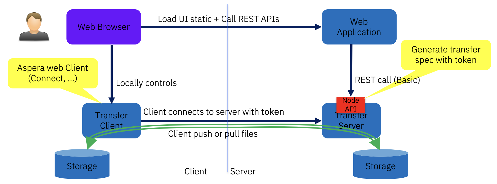
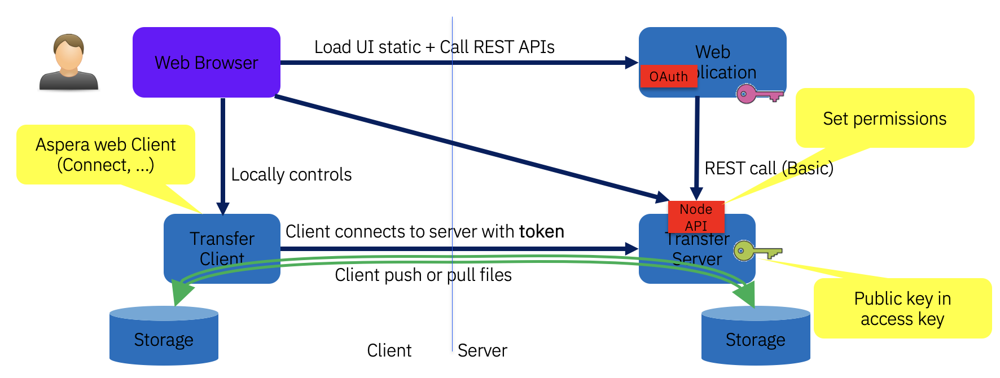

# Using Aspera API for Integration and Automation
<!--
PANDOC_META_BEGIN
subtitle: "Unofficial document"
author: "Laurent MARTIN"
PANDOC_META_END
-->
<!-- markdownlint-disable MD033 MD060 -->

## Introduction

This document examines the various methods for integrating with IBM Aspera APIs to harness its high-performance file transfer capabilities.

IBM Aspera data transfer technology is delivered through a suite of products, each comprising components that expose APIs for integration.

Ultimately, most integrations aim to leverage the IBM Aspera FASP protocol to achieve maximum transfer speeds.

All Aspera transfers involve a client connecting to a server to either push or pull files.
The client component is based on either one of Aspera's client applications, a server, or a custom application built using Aspera's client libraries.
The server component is always the IBM Aspera High-Speed Transfer Server (HSTS).



### Base rules for a transfer

100% of transfers using Aspera consist in:

- A `ascp` process started in client mode connecting to a transfer server (SSH or WSS)
- Upon successful connection: a `ascp` process in server mode is started and listens on UDP.
- The connection is direct between client and server using the IP protocol (there can be Aspera proxies in the middle (reverse, forward)), with one TCP connection per transfer session (`ascp` process), and one UDP session.
- Some sort of authorization is required (either just SSH credentials, or a transfer token)
- If client sends the files, then it is an upload. If client receives the files, it is a download.
- In all the cases a transfer session is initialized using a "transfer specification", a JSON structure (except direct execution of `ascp` which uses command line options).

### The basics

When using Aspera to transfer data between two storage systems, a few fundamental concepts always apply.
These concepts are independent of the specific API, SDK, or product being used (`ascp`, `ascli`, `transferd`, **Node API**, server REST API, etc.).

#### Client and server roles

An Aspera transfer always involves two distinct roles:

- Client: the side that initiates the transfer.

- Server: the side that accepts the transfer.

The client may either send data to the server (upload) or retrieve data from it (download), but the direction of the data flow does not change the roles: the initiator is always the client.

#### Server-side storage access (docroot / storage root)

The server side is always configured with access to a storage backend.

This is done through:

- a docroot, or

- an access key + storage root (conceptually equivalent).

The server is responsible for accessing the underlying storage, which can be:

- local filesystem storage, or

- supported object storage (via **PVCL**, such as S3-compatible storage, cloud object stores, etc.).

To do this, the server must be provided with appropriate credentials, which depend on the storage type:

- filesystem permissions for local storage,

- cloud/object-storage credentials for object storage.

Without this configuration, a server cannot read or write data, regardless of the client.

#### Client types and storage capabilities

The client side can take different forms:

- Simple transfer clients

  Examples: ascp, ascli, transferd, AfD, custom SDK-based clients.

  These clients only support local filesystem storage.

  They do not define a docroot or storage root.

  Files are always read from or written to the local machine where the client runs.

- Servers acting as clients

  An Aspera server can also act as a client.

  In that case:

  - The server-as-client is configured exactly like a server:

    - it defines a docroot (or storage root),

    - it may access object storage,

    - it requires storage credentials.

  - Credentials for object storage are provided either:

    - directly in the docroot URL, or

    - via the access key configuration.

  This allows transfers between two non-local storage systems, such as object storage to object storage.

#### Remote control of clients

A client does not need to be manually started by a user.
Clients can be remotely controlled:

- A simple client (e.g. `ascli`) can be started remotely via SSH.

- `transferd` exposes a gRPC API that allows remote control of transfers.

- An Aspera server acting as a client can be remotely controlled using its REST API:

  - for example, `POST /ops/transfers` to initiate a transfer.

  - access to this API itself requires proper authentication.

In all cases, the entity triggering the transfer is still the client, even if it is controlled remotely.

#### Transfer authorization

To initiate a transfer, the client must be authorized to access the server.

This authorization can take different forms, depending on the environment and API:

- SSH-based credentials (user/password or key),

- transfer tokens (JWT or similar mechanisms).

Without valid authorization, a transfer cannot be started, even if both client and server are correctly configured.

### APIs: Components: Server, Client, Application

Those 3 types of software components provide APIs:

- **Transfer Server (HSTS)**: Node API (REST)
  - Monitor and manage transfers (`GET /ops/transfers`)
  - Start server-to-server transfer (as "transfer client" to remote server) (`POST /ops/transfers`)
  - Get authorization for transfer (typically for web) (POST /files/*_setup)
  - Basic file system operations (list files, create folder, etc...) (GET/POST /files/...)
  - Supports "watch folder" (includes growing file transfer) (`/watchfolders/`...), `async`, stream, etc...
  - Also provides the server side for FASP transfer (UDP, `ascp`)
- **Applications**: Faspex, Shares, AoC, Console, Orchestrator API (REST)
  - Provide REST API
  - Do not embed the FASP protocol, but the web app uses the Node API of Transfer Servers
  - Can control and use several Transfer Servers
  - Applications authenticate users, manage users, manage file resources, authorize users for transfers
- **Transfer Clients**: SDKs
  - Transfer Daemon provides a **gRPC** interface that can be used virtually from any language.
  - Provides transfer session management (start, monitor)
  - internally starts one `ascp` process per transfer session.
  - Web SDK, HTTP GW SDK, Desktop SDK: provides the equivalent of Transfer SDK API in the browser (JavaScript)
  - Mobile SDK: use the equivalent of Transfer SDK for mobile (mobile SDK, swift(iOS) or java(Android)). (under review)

> [!NOTE]
> Aspera legacy client SDK was called "FaspManager" and is now deprecated (do not use).
> It provided language specific implementations: C/C++, Java, Go, Python, .NET, C# (, Ruby).
FaspManager2 (based on SWIG) is also deprecated.

### Addresses and Credentials

Examples provided in this document use the following virtual connection information:

- `hsts1.example.com` : Address of HSTS 1.
- `my_hsts1_xfer_user` : A transfer user with SSH credentials on HSTS 1.
- `my_hsts1_xfer_pass` : Password for `my_hsts1_xfer_user`.
- `my_hsts1_node_user` : A node API user (or access key id)
- `my_hsts1_node_pass` : Password for `my_hsts1_node_user` (or access key secret).
- `hsts2.example.com` : Address of HSTS 2.
- `my_hsts2_node_user` : A node API user (or access key id)
- `my_hsts2_node_pass` : Password for `my_hsts2_node_user` (or access key secret).

### Transfer specification, authentication, authorization

To start a transfer, the client side must be authorized by the server side.
Two types of transfer authorizations are supported (see later):

- SSH authentication/authorization: This is the legacy mode used with Desktop Client or Server-Server transfers
- Token authorization: This is the mode used for example when a web application manages users

Other parameters are required when starting a transfer, such as transfer direction, or others are optional, such as target speed.

This document will show session parameters using the standardized JSON format "transfer specification" and refer to session parameters as **transfer spec**.
This is the native format in used in Web SDKs, `transferd`, Node API and `ascli`.
Only `ascp` still does not support transfer spec and still uses regular command line options.

Example of a simple transfer spec for download from demo server (without token):

```json
{
    "remote_host"     :"hsts1.example.com",
    "ssh_port"        :33001,
    "remote_user"     :"my_hsts1_xfer_user",
    "remote_password" :"my_hsts1_xfer_pass",
    "direction"       :"receive",
    "destination_root":".",
    "paths":[
        {"source":"/aspera-test-dir-tiny/200KB.1"}
    ]
}
```

An example with transfer authorization token is provided later.

Use of transfer spec is pervasive in Aspera to describe and start a transfer session (only `ascp` does not use it, yet).

90% of transfer spec parameters are identical between the various APIs (node, `transferd`, Connect, ...)

Parameters can be found in the various API definitions, or in CLI :

```bash
ascli conf ascp spec
```

### Client-side minimum components

On client side, the minimum setup for FASP transfer consists in two files:

- `ascp` (executable)
- `aspera-license` (free license file, in same folder as `ascp` (or `../etc`))

Those files can be found in the [`transferd` archive](https://developer.ibm.com/apis/catalog?search=%22aspera+transfer+sdk%22).

They can also be found in free clients.

### First `ascp` invocation

Test `ascp` with a few useful options:

```bash
ascp -A
```

```console
IBM Aspera SDK version 1.1.1.52
ascp version 4.4.2.572 7fd3699
Operating System: MacOSX
FIPS 140-2-validated crypto ready to configure
AES-NI Supported
License max rate=(unlimited), account no.=1, license no.=57999
Enabled settings: desktop_gui
```

```bash
ascp -h
```

```bash
ascp -hh
```

```bash
ascp -DDA
```

```bash
ascp -DDL-
```

### Sample optional config file for client `ascp`

On Client-side, optionally, it is possible to create a configuration file: `aspera.conf` (in same folder as `ascp`, or `../etc`, see [README.configuration-files.md](README.configuration-files.md)).

Example of configuration file: `aspera.conf`, on client side (optional):

```xml
<?xml version='1.0' encoding='UTF-8'?>
<CONF version="2">
<default>
    <file_system>
        <resume_suffix>.aspera-ckpt</resume_suffix>
        <partial_file_suffix>.partial</partial_file_suffix>
        <replace_illegal_chars>_</replace_illegal_chars>
    </file_system>
</default>
</CONF>
```

Smallest configuration file:

```xml
<CONF/>
```

> [!NOTE]
> This file is mandatory on server side.
> Modification of this file is facilitated on Transfer servers with the command `asconfigurator`, not available in client applications and SDK.

### CLI

To test most Aspera APIs and transfer authorization types, one can try the open-source tool: `ascli`.

See [manual for installation](https://github.com/IBM/aspera-cli).

`ascli` :

- Connects to all types Aspera servers
- Provides a logging capability that traces API calls
- Starts transfers using either:
  - Transfer SDK
  - `ascp`
  - Node API
  - Web client (Connect, Aspera for Desktop)
  - HTTP Gateway

Examples in this document are illustrated with `ascli`.
The developer can monitor internal API calls, as well as generated transfer spec using option: `--log-level=trace2`

### Where to start

There are many scenarios to use Aspera to send files.
Get familiar with what an Aspera transfer is.
Get the `ascp` binary from transfer SDK or one of the free clients, together with the free license file.
See `transferd` package earlier mentioned, or `ascli`.
Execute command line transfers with `ascp` to the demo server using SSH credentials.
Do the same with the client method chosen (`transferd` + gRPC).
If you send to an Aspera application (Faspex, AoC) : use the REST API to create a **transfer spec** using the application API (and get token authorization).

- Do you need to receive files on your Aspera Server ?
- Install an Aspera Transfer Server to test with (Evaluation license ? Dev license?)
- Initiate a transfer to your server.
- Initiate a transfer to your server using the chosen methods (Connect SDK(web), node, etc...)

## Integration Scenarios

This section exhibits various file transfer scenarios.

It shows how a FASP transfer is started using a transfer specification.

The transfer is started using various transfer client types/SDK (CLI, web, app, server)

The transfer specification may contain transfer authorization using either (see later):

- SSH credentials
- Authorization token

Any client type and SDK can be used with any type of transfer authorization, this is not correlated.

Scenarios contain typical mix of client SDK and transfer authorization type.

### S1- The simplest integration: start a transfer with a script and `ascp`



Scenarios:

- I need to replace `scp` or `sftp` in a script and use my existing SSH credentials (password or key)
- I am provided with bare Aspera Transfer credentials, and I need to transfer to that server using my scripts.

| Client | API          | Authorization|
|--------|--------------|--------------|
| script | command line | SSH          |

The simplest and low-level integration consists in starting an Aspera transfer as a transfer client with a Transfer Server (upload or download).
This consists eventually in starting the `ascp` executable in client mode, locally.
Credentials required: SSH credentials provided by the admin of the HSTS server.
This can be done easily in a script.
For example, using bash:

```bash
#!bin/bash
ASPERA_SCP_PASS=my_hsts1_xfer_pass ascp --mode=recv --host=hsts1.example.com -P 33001 --user=my_hsts1_xfer_user aspera-test-dir-tiny/200KB.1 .
```

This starts the `ascp` executable with session parameters in command line (and env var for password).
`ascp` comes with many session options, a manual can be found in `man ascp` or here: [HSTS Doc] &rarr; ascp command reference.
This is adapted for a simple script-based integration, but this solution suffers the following limitations:

- No easy way to get progress feedback programmatically (progress bar on terminal)
- No automatic retry of failed transfer, script must implement a loop
- No programmatic API, need to spawn a process with arguments

Equivalent with `ascli`: (includes resume)

```bash
ascli -N server --url=ssh://hsts1.example.com:33001 --username=my_hsts1_xfer_user --password=my_hsts1_xfer_pass download aspera-test-dir-tiny/200KB.1
```

> [!NOTE]
> Display the generated transfer spec with additional option --log-level=debug

Equivalent with `asession` (from `aspera-cli` gem), using a transfer spec: (includes progress and resume)

```bash
asession @json:'{"spec":{"remote_host":"hsts1.example.com","remote_user":"my_hsts1_xfer_user","ssh_port":33001,"remote_password":"my_hsts1_xfer_pass","direction":"receive","destination_root":".","paths":[{"source":"/aspera-test-dir-tiny/200KB.1"}]}}'
```

### S2- Start a transfer with Transfer SDK and listen for events



Scenarios:

- I need to transfer files at high speed from my home-grown application to a central place using basic OS credentials
- I am provided with bare Aspera Transfer credentials, and I need to transfer to that server using my application written in java, C++, .NET, python, etc...

| Client                    | API                  | Authorization|
|---------------------------|----------------------|--------------|
| Custom Client Application | Transfer Daemon gRPC | SSH          |

If the integration to start a simple transfer job is made in an application written in one of the languages: C, C++, C#, Java, Python, Go, Rust, etc...
Then the best option is to use the newer **Transfer Daemon**.
This component can be freely downloaded here: [Transfer SDK].
It is basically a wrapper around the `ascp` executable and daemon `transferd` and comes with examples.

The basic usage of the API is:

- Initialize the library (or gRPC stub)
- Optionally create an event listener
- Create a transfer spec (with all transfer session parameters)
- Start the transfer job
- Monitor the transfer job (events)

The event listener callback will be called every second with statistics and information about the transfer.
The same `ascp` executable and `aspera-license` file from previous step can be used (`transferd` package or free client).

Note that in those two possibilities, the transfer is run locally.
Development of a mobile app is similar, the mobile SDK providing a library to start transfers.
The Transfer SDK provides several code examples in several languages.

Other examples: [Laurent's Samples](https://github.com/laurent-martin/aspera-api-examples)

Equivalent with `ascli`:

```bash
ascli -N server --url=ssh://hsts1.example.com:33001 --username=my_hsts1_xfer_user --password=my_hsts1_xfer_pass download aspera-test-dir-tiny/200KB.1 --log-level=debug
```

```console
...
D, [2019-12-09T13:53:09.541005 #58353] DEBUG -- : mgr is a Asperalm::Fasp::Local
D, [2019-12-09T13:53:09.541110 #58353] DEBUG -- : ts (json)=
{
  "remote_host": "hsts1.example.com",
  "remote_user": "my_hsts1_xfer_user",
  "ssh_port": 33001,
  "remote_password": "my_hsts1_xfer_pass",
  "direction": "receive",
  "destination_root": ".",
  "paths": [
    {
      "source": "aspera-test-dir-tiny/200KB.1"
    }
  ]
}
D, [2019-12-09T13:53:09.541866 #58353] DEBUG -- : ENV={"ASPERA_SCP_PASS"=>"my_hsts1_xfer_pass"}, ARGS=["-k", "2", "--mode", "recv", "--user", "my_hsts1_xfer_user", "--host", "hsts1.example.com", "-P", "33001", "--dest64", "--file-list=/Users/laurent/.aspera/mlia/filelists/c9e8015a-cf45-4deb-9bf4-0e28d96d0f90", "Lg=="]
...
```

Lots of debug information, look for transfer spec in logs.
> [!NOTE]
> Internally `ascli` uses a "transfer agent" which can be the bare `ascp`, or Transfer Daemon, or other Aspera components.

### S3- Start a transfer in a web browser



Scenarios:

- I need to transfer files at high using a web browser and being authorized by some web Application (Custom, Faspex, Shares, AoC, ...)

Typically, authentication/authorization is performed in the web app, and a transfer token is used to authorize transfers.

| Client.     | API          | Authorization|
|-------------|--------------|--------------|
| Web Browser | web SDK      | Token        |

If the transfer must be started by a user in the context of a web browser, then the **IBM Aspera JavaScript SDK** can be used (for Aspera for Desktop and HTTP GW).
It consists in a JavaScript library used similarly to the "Transfer SDK" (build session parameters, start transfer, monitor progress).

Reference (includes sample code): [Aspera API Hub] &rarr; IBM Aspera JavaScript SDK :
<https://developer.ibm.com/apis/catalog/aspera--ibm-aspera-sdk/Introduction>

Example using AfD client with `ascli` (here, not in a browser):

```bash
ascli -N server --url=ssh://hsts1.example.com:33001 --username=my_hsts1_xfer_user --password=my_hsts1_xfer_pass download aspera-test-dir-tiny/200KB.1 --transfer=desktop
```

The transfer spec remains identical as in previous `ascli` example.
Only the transfer agent (`--transfer`) is changed from local transfer SDK to Aspera for Desktop.
Aspera for Desktop is almost exclusively used in web context, `ascli` is provided as an example only.

### S4- Start a Server-Server transfer with Node API and SSH credentials



Scenarios:

- I need to transfer files between 2 severs in an automated manner or using REST APIs.
- I own the system used as client side (an HSTS), but not the remote system for which I have only SSH credentials.
Machine-to-machine transfer

| Client                    | API                  | Authorization |
|---------------------------|----------------------|---------------|
| Aspera Transfer Server    | Node API             | SSH           |

This is the method used for automated server to server transfers.
A transfer can be started remotely (using its REST API) on a server to another remote server.
2 servers here, but one starts the transfer as client, and connects to a remote server
The managing application uses the "Node API" to control the client side of the transfer.
Basically: `POST /ops/transfers` with a JSON payload containing session parameters: transfer spec with SSH credentials of the remote server.

Example of use with `ascli`: (for demonstration of use of API)

```bash
ascli --url=ssh://hsts1.example.com:33001 --username=my_hsts1_xfer_user --password=my_hsts1_xfer_pass --transfer=node --transfer-info=@json:'{"url":"https://hsts2.example.com","username":"my_hsts2_node_user","password":"my_hsts2_node_pass"}' --log-level=debug server download aspera-test-dir-tiny/200KB.1
```

> [!Note]
> Option `--transfer=node` tells to start the transfer remotely.

In this example, the remote server: `hsts2.example.com` is used (as client) to download from server `hsts1.example.com`.

### S5- Start a transfer with Token Authorization


Scenarios:

- I need to transfer files between my custom client app, and my custom server app, using my own authentication/authorization.

| Client                    | API                  | Authorization |
|---------------------------|----------------------|---------------|
| Custom Client Application | Transfer SDK(client app)<br/>Node API (server app) | Token |

In previous examples, transfers were started using SSH credentials and no token, using various client application types: command line, Transfer SDK, browser, server (node) or even mobile.
Using SSH credentials, the authentication and transfer authorization is provided by the bare Aspera Server and its host operating system.
In fact, in many integration cases, a custom (e.g. web) application server takes care of user authentication and transfer authorization (e.g. RBAC).
In this case, once the server application has authenticated and authorized a transfer, it will convey this transfer authorization by generating a "transfer authorization token".
Then, the transfer client provides this token to the Aspera server to get authorized to transfer to it.
Several types are supported:

- Aspera Auth Token (ATx)
- Basic Authorization
- Bearer Token

Token generation is detailed in next section.
The Aspera token type is a simple choice, as no previous authorization is required in advance, and the server application generates it on the fly after it has checked that the application-level user effectively has rights.
Aspera tokens are encrypted (using the secret token_encryption_key, or a dynamic key) and contains transfer username, transfer direction, file information, validity period.
This token is generated by calling the node API. Validity is specified in `aspera.conf` and is valid for 1 day by default (`token_life_seconds`).
Basic and Bearer tokens are used in specific cases (e.g. AoC uses "access keys", where Bearer tokens can be used and validated by a private/public key pair)

The "AsperaClient" is using one of the SDKs for transfer:

- Transfer(gRPC)
- Web (JavaScript)
- Mobile(swift, java)
- Node(REST)

### S6- Start a Server-Server transfer with Node API and Transfer token



Scenarios:
I own both systems used for the transfer (both are HSTS) and I use node API to get transfer authorization on destination, and node API to initiate the transfer on the source system.
Machine-to-machine transfer

| Client                    | API                  | Authorization |
|---------------------------|----------------------|---------------|
| Custom Client Application | Transfer SDK(client app)<br/>Node API (server app) | Token |

This is the method used for automated server to server transfers if one owns both servers and token-based transfer is preferred.
First the managing application must retrieve a transfer authorization (as well as transfer details, such as server address) using the Node API on the **server side of the transfer**:
`POST /files/upload_setup` with transfer request, which generates a transfer spec.
Then, the managing application uses the Node API to control the **client side of the transfer**.
Basically: `POST /ops/transfers` with transfer spec generated previously.

A common mistake is to call both APIs on the same server: client side.
Incidentally, this could work if the transfer username is the same on both sides, and if the `token_encryption_key` the same on both sides for that transfer user.
But in general, it will fail, either because the transfer user is different, or the token cannot be decrypted (different encryption key).
So, really, authorization shall be first generated on the server side, and transfer shall be initiated on the client side.

Example of use with `ascli`: (for demonstration of use of API)

```bash
ascli --url=https://hsts1.example.com:9092 --username=my_hsts1_node_user --password=my_hsts1_node_pass --transfer=node --transfer-info=@json:'{"url":"https://hsts2.example.com","username":"my_hsts1_node_user","password":"my_hsts1_node_pass"}' --log-level=debug node upload aspera-test-dir-tiny/200KB.1
```

> [!NOTE]
> Option `--transfer=node` tells use starts the transfer remotely on the node specified in -transfer-info as client.
> In this example, the remote server: `hsts2.example.com` is used (as client) to upload to `server hsts1.example.com`

### S7- Polling on transfer status on Node API

The Node API endpoint: [`GET /ops/transfers`](https://developer.ibm.com/apis/catalog/aspera--aspera-node-api/api/API--aspera--ibm-aspera-node-api-4-4#get511225093) allows getting information on past and current transfers.
Such information is stored on HSTS in the Redis database.

Retention and activation is controlled by `aspera.conf` parameters:

| Parameter            | Description |
|----------------------|-------------|
| `activity_retention` | Controls how long data is kept in database.<br/>Default: 1d12h            |
| `activity_logging`   |             |
| `activity_*`         |             |

> [!NOTE]
> Typically, `activity_retention` can be given a shorter value to keep DB smaller.
>
> `asconfigurator -x "set_server_data;activity_retention,2h"`

By default (no query parameter), it returns a number of transfer information.
Such call returns a response with the `Link` header set:

```text
Link: <https://hsts.example.com:9092/ops/transfers?iteration_token=1440571>; rel="next"
```

Calling the URL specified in `Link` will return subsequent results, and so on...
To get all information, repeat with the response' Link URL until response is an empty array and the `iteration_token` does not change.
When new information is available, a new call will return data and a new `iteration_token`.
A number of query parameters allow filtering only necessary information, for example: `active_only=true`.
Using query `view=id` will return only transfer ids, and specific information can be retrieved using `GET /ops/transfers/<id>`.

For example, using `ascli`:

```bash
ascli node transfer list --query.active_only=true
```

Example of algorithm to get notification of progress of transfers:

```ruby
iteration_token = 1
transfers = []
loop do
    response=GET /ops/transfers?iteration_token=$iteration_token
    if response.iteration_token == $iteration_token
      # all current responses received, process and temporize
      call process(transfers)
      transfers = []
      sleep 5
    else
      # additional transfers received, store and try to get more, before processing all
      transfers.concat(response.transfers)
      iteration_token = response.iteration_token
    end
end
```

## Transfer authentication and authorization

Initiating a transfer session in Aspera requires a valid transfer specification (**transfer spec**), which encapsulates all necessary parameters for the transfer, including **authentication and authorization** details.
This applies universally, regardless of the method used to start the session.

All transfers are executed on the server under a designated **transfer user**.
The method of authorization is decoupled from the session initiation mechanism, meaning any supported authorization method can be used with any startup interface—whether via script, Transfer SDK, Node API, HTTPGW, mobile, or web applications.

Aspera supports multiple authorization mechanisms:

- OS-Level Authentication (SSH-based)
  - Similar to SFTP, this method uses the operating system's user accounts and SSH authentication.
  - Authorization is managed via `aspera.conf`.
  - Commonly used in legacy environments or high-performance computing (HPC) systems where OS-level user control is required.

- Token-Based Authorization
  - Used when user authentication is handled externally (e.g., by a third-party application).
  - Required for modules that do not use SSH authentication, such as:
    - WebSocket Session
    - Legacy HTTP Fallback
    - HTTP Gateway

There are three types of tokens:

- Aspera Transfer Token (ATx)
  - Generated via the Node API (`/files/*_setup`) using the "gen3" method.

- Basic Token
  - Constructed using access key credentials from the Node API.

- Bearer Token
  - OAuth-style token, typically a JWT signed with a private key.
  - Generated by a custom application and verified by the HSTS using the corresponding public key.
  - Permissions are enforced via the Node API (`/permissions`).

If a token is provided and SSH is used for transport, the transfer user must have Aspera SSH public key authentication enabled.
In this case, SSH authentication relies on public keys, while the corresponding private keys are embedded in the SDK or client applications.

### A1- SSH Authentication

For simple transfer initiation in client-server or server-server case, no previous application provided authorization is required.
The username / pass or key has been pre-arranged between the server provider and client.
See the transfer spec example earlier.
This is often used in machine-to-machine transfers where authentication is based on a technical operating system user n server side and SSH.
Transfer authorization is based on a top level **docroot** specified in `aspera.conf` on server.
See transfer spec earlier.

Typical End-user usage: Simple Client-Server.
This is the legacy mode of authentication / authorization, like `scp` or `sftp`.
In this mode, authentication/authorization is done directly during the transfer session: the transfer server provides the authentication (with the local SSH server) and access control (with `aspera.conf`).
No external web application controls user authentication or file access rights.
The authentication uses the SSH server (with username + password or SSH private key).
File transfers are limited to the user's "docroot" (`aspera.conf`) and access rights on storage.
Only sessions started with SSH supports this mode (Not Web Socket Session/HTTPS, or HTTPGW).
Once SSH authentication is done, typically the user can transfer any file with possible limits in `aspera.conf` and file system rights.

### A2- Aspera Transfer Token Authorization

#### A2: Typical usage

Broker application, e.g. Web-based control:

- An external (to transfer server) application (Aspera or custom web app) first authenticates a user in web context (possibly with an external auth system, like SSO) and authorizes a transfer (based on the application access right management).
- The application generates a **transfer spec** with an **authorization token** for every transfer requested.
- Transfer authorization tokens is generated before starting the transfer on the transfer server using the node API: `POST /files/<upload|download|sync>_setup`

#### A2: Scenario



1. User is authenticated in Application (web, API, etc...)
2. User calls the app's API with whatever security mechanism (OAuth token, cookie, etc...)
3. The app checks the user's rights based on own logic and then calls the node API to generate a transfer spec with token
4. Transfer spec is transmitted to the client side (e.g. web browser) which transmits it to the local Aspera client, which eventually connects to the transfer server where it is authorized for transfer.

#### Token generation

When the user authentication and authorization is managed by a third-party application, then the application needs to provide the client side with a secure "token" that will carry the transfer authorization.
The application uses node API end points:

- `/files/upload_setup`
- `/files/download_setup`
- `/files/async_setup`

This returns a **transfer spec** that can be directly provided to the transfer agent to do the transfer.
The authorization is based on an authorization token, generated by the node daemon.

Example:

```bash
curl -s -u my_hsts2_node_user:my_hsts2_node_pass https://hsts2.example.com/files/download_setup -d '{"transfer_requests":[{"transfer_request":{"paths":[{"source":"/aspera/aspera-test-dir-large/1GB"}]}}]}'
```

```json
{ "transfer_specs": [ { "transfer_spec": {
  "paths": [ { "source": "/aspera/aspera-test-dir-large/1GB" } ],
  "source_root": "",
  "destination_root": "",
  "token": "ATM2_ACsPr3W_d35XOqASXde2bPbvadFuMeG15Hoy9M61_zLbGEAAF465hdKlCgiEOh3gjRfgtf_2MTA",
  "direction": "receive",
  "cipher": "aes-128",
  "tags": null,
  "rate_policy_allowed": "fixed",
  "rate_policy": "fair",
  "target_rate_kbps": 100000,
  "min_rate_kbps": 0,
  "remote_host": "hsts2.example.com",
  "remote_user":   "xfer",
  "sshfp": "b42dcb718dd3a04c90e160817d40da9af6e8895a",
  "ssh_port": 33001,
  "fasp_port": 33001,
  "http_fallback": true,
  "http_fallback_port": 8443
} } ] }
```

Aspera Transfer tokens start with `AT` and end with `TA`.
They are generated using the **gen3** Node API (`/files/*_setup`).
They can also be generated using utility: `astokengen`, but this shall be avoided(legacy).

Generation of Aspera Transfer tokens require the use of a token encryption key (symmetric) which is either configured statically in `aspera.conf` (`token_encryption_key`) or uses `askms` (dynamic keys).
This type of token is simply binary metadata encrypted (and then decrypted) with that key and includes:

- Transfer direction (send/receive, as see from server)
- Transfer user
- Date validity
- Hash of authorized file list

When a transfer is initiated with a server and contains such token, that server will check each of these elements are valid, else transfer is refused.
This means that: in order to be authorized to transfer with a transfer server using such token, the token (and transfer spec) must be generated on that same server (or cluster) using the node API.

### A3- Aspera Bearer Token Authorization

#### A3: Typical usage

Complex application using OAuth2

- An external (to transfer server) application (Aspera or custom web app) authenticates users and grant access to its OAuth API in web or API context (possibly with an external auth system, like SSO).
- A private key is used in the application to sign bearer tokens, and the public key is placed on the HSTS in the "access key" to be able to check signatures (and authenticity).
- The Bearer token contains information about the user's identification and group membership.
- The application sets permissions on access to folders on HSTS based on user ID or group ID.
- The user gets a single bearer token from the app which grants access to any transfer.

When a transfer starts on HSTS it will check if the resource (folder/file) is granted access to the user and group IDs found in the provided bearer token.

There is no API to generate a full transfer spec directly, but one can use the gen3 API to generate a base transfer spec on the HSTS, and then change the token in it with the bearer token.

#### A3: Scenario



1. User get transfer bearer token for a specific HSTS after authentication to app.
2. User uses that bearer token to start transfers. No need to re-generate a token for each transfer.
3. Use can also use the bearer token to list files on HSTS directly.
4. Permissions to access files on HSTS are managed out of band previously.

An example on how to configure and generate a bearer token is provided in `ascli` manual.

The scenario to prepare is:

1. prepare an Aspera HSTS for use with access key, and create an access key, for example using API or `ascli`:
<https://github.com/IBM/aspera-cli?tab=readme-ov-file#create-access-key>
2. follow:
<https://github.com/IBM/aspera-cli?tab=readme-ov-file#generate-and-use-bearer-token>

## Integration of Aspera Products: Aspera WEB applications

For integration with IBM Aspera applications: use their embedded authentication/authorization and APIs, those, in turn, will provide the transfer spec (with token) necessary to initiate a transfer.

For more details refer to [Aspera API Hub]

The general flow is the same as seen earlier with the custom client and server.

Aspera Web Apps provide REST APIs.
Some are related to transfer authorization, and others are not directly (e.g. list files, create a user, etc...).

### Faspex 5

#### Authentication

Faspex 5 uses OAuth 2.0 for authentication and authorization, a Bearer token shall be used for REST API calls.
For automated operations, the bearer token shall be generated using JWT (JSON Web Token) signed with a private key.

The first step for a client application is to get a client ID and secret from Faspex 5.
This is done in the Faspex 5 web interface, in the "API Clients" section.

This client ID and secret together with the private key are used to generate a JWT token by calling the Faspex 5 API endpoint: `/token`.
Refer to the [Faspex 5 documentation](https://www.ibm.com/docs/en/aspera-faspex/5.0) for details or examples in GitHub.

A user generates, once, a private key and a public key pair.
The public key is configured in Faspex 5 in the user's profile or in the API client configuration.
The private key is used to sign the JWT token, which is then sent to the Faspex 5 API endpoint `/token` to obtain a bearer token.
Refer to examples in GitHub.

Once the bearer token is generated, it can be used to call the Faspex 5 REST API endpoints.

#### Transfers (send/receive packages)

Faspex 5 provides a REST API to manage transfers, including sending and receiving packages.

The first step is to create a transfer spec using the Faspex 5 API.
This transfer spec is either for sending a new package, in that case one must first create a package, or for receiving an existing package, identified by a unique ID.
A user can list received packages, and then select one to download.
The Faspex 5 API provides endpoints to create a transfer spec for sending or receiving packages.

The second step is to use the transfer spec to start the transfer using one of Aspera transfer agents (Transfer Daemon, Node API, ...).

### IBM Aspera on Cloud

Similar to Faspex 5, AoC uses OAuth 2.0 for authentication and authorization, using API client ID and secret and `/token` with JWT and private key.

There is no endpoint to create a transfer spec directly, but a transfer spec can be built relatively easily, refer to GitHub.

### IBM Aspera Shares

Same API as Node API. (internally, Shares makes calls to the node API for transfer spec generation).

## Integration of Aspera Products: Transfer user, Docroot, Storage root, Access keys

### Key concepts

When a transfer (upload/download) session is received on server side, the transfer process is executed as a given OS user.
This user is called "transfer user".
Access rights to file system with this user apply, not in the case of object storage.
When an application accesses the HSTS Node REST API, it can use one of the following types of authorization:

- Basic: Node user (+ password) [docroot]
- Basic: Access Key (+ secret) [storage root]
- Bearer: OAuth 2.0 Bearer token [storage root]

An initial **Node User** is necessary on the HSTS to create access keys.
Later, sub access keys can be created in access keys.
AoC provides an API (ATS) to create access keys on SaaS nodes.
A node user is always associated (at creation, see `asnodeadmin`) to a transfer user.
A transfer user can be assigned with either (exclusive):

- A single "docroot", and the node API can be used "as-is", but access keys cannot be created with it
- Or a list of file restrictions, in this case the node user can be used to create access keys, whose "storage_root" must match one of the restrictions.

Refer to HSTS manual sections: "Docroot vs. File Restriction"
In both cases, node API calls and transfers are "jailed" either in the docroot, or in the storage_root of the access key.

### Integration of Aspera Products: How to test

In order to test, one needs:

- Client-side libraries (Transfer SDK, Connect SDK, Mobile SDK) or API definitions (node API, web app API)
- Server-side testing server

## Transfer clients

### Native executable: `transferd`

The transfer daemon `transferd` provides a gRPC interface for managing transfers.
A `proto` definition file is included in the `transferd` package.

#### Starting up

The daemon must be started in order to manage transfers.
It's up to the developer to decide how to start the daemon.

For quick development scenario, the daemon can be started manually in a separate terminal.

For server-level applications, the daemon can be started as a system service. (`System D`)

For end-user applications, the daemon can be started as a background process by the main process.

#### Examples

Example in various languages are provided as part of the `transferd` SDK, as well as at:

<https://github.com/laurent-martin/aspera-api-examples/tree/main/app>

### Web API

### CLI: `ascli`

### Mobile: Android, iOS
