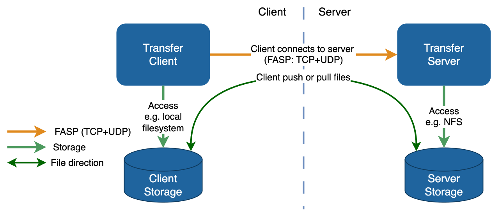
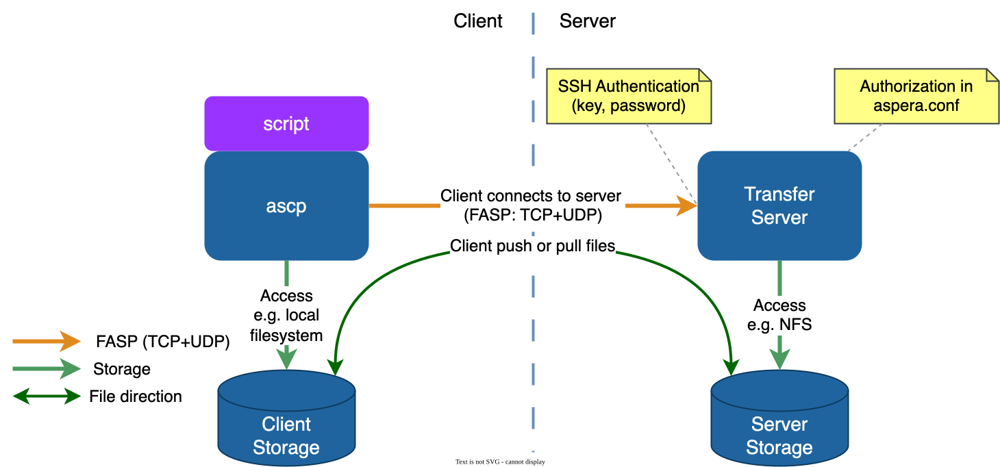
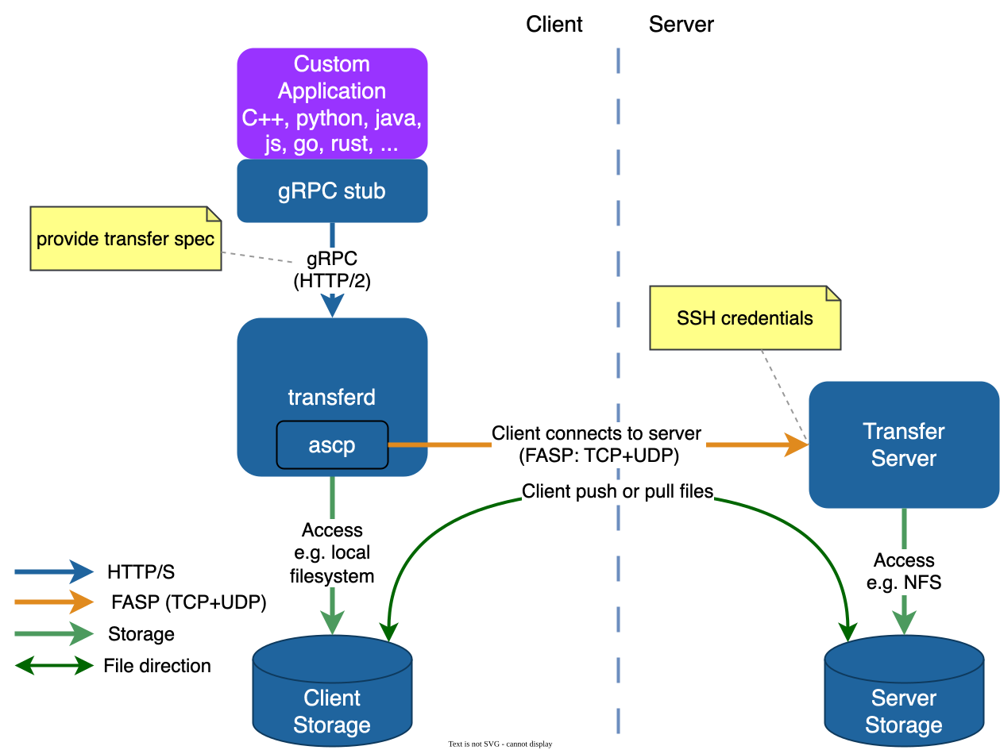
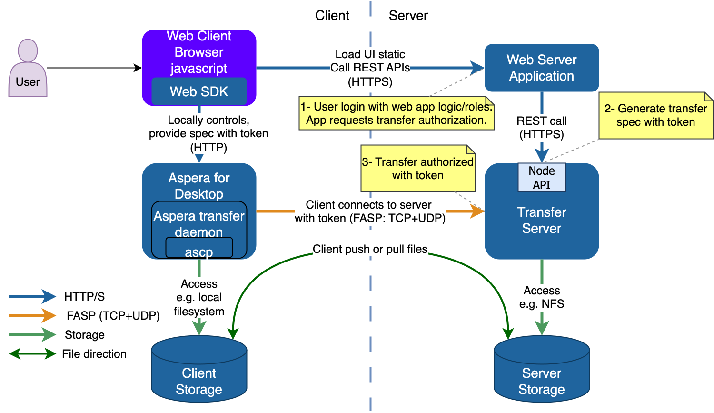
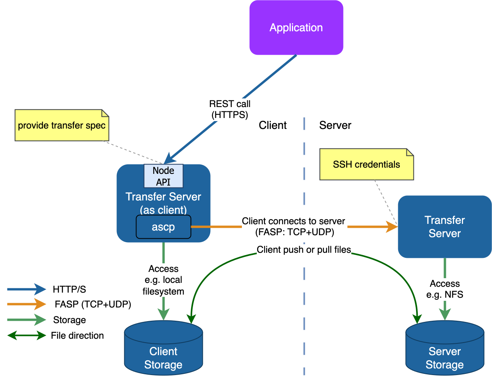
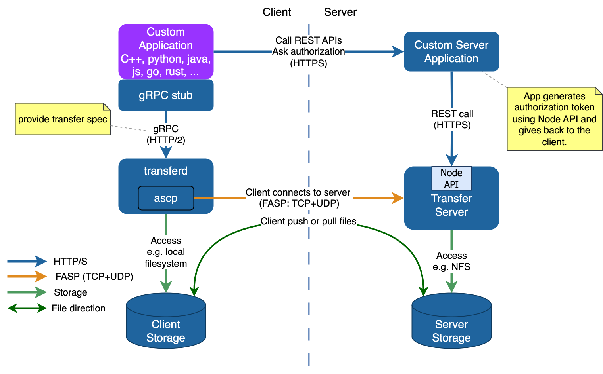
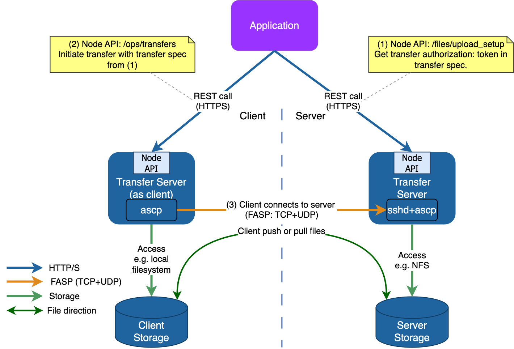
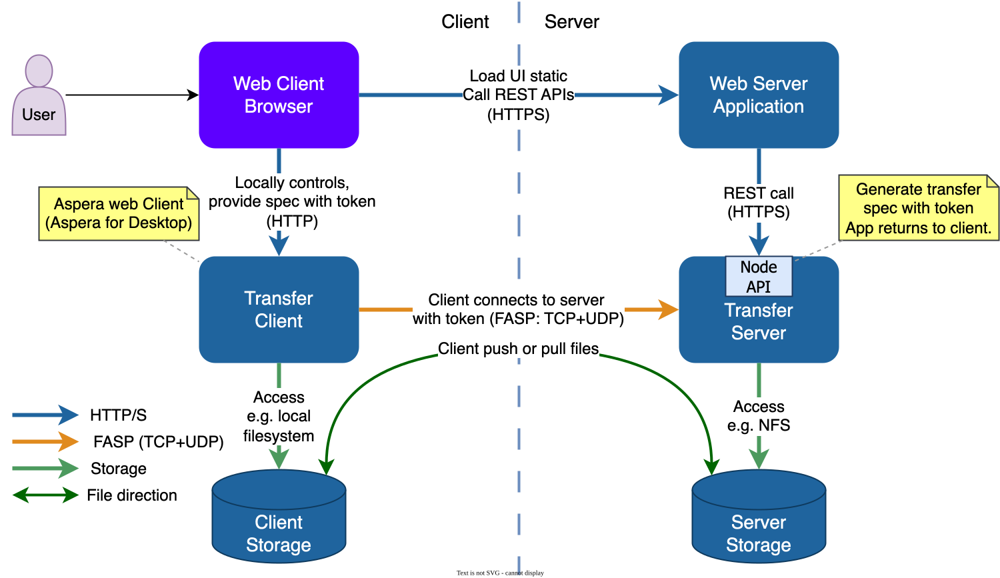
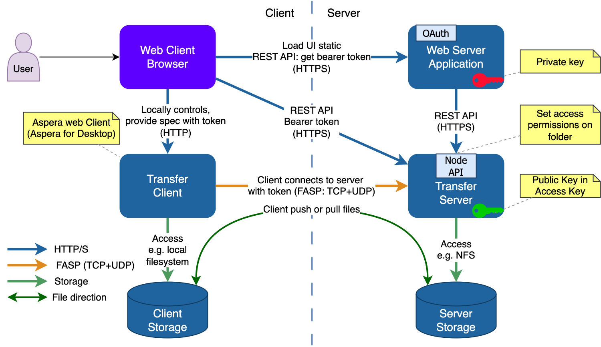

# Using Aspera API for Integration and Automation
<!--
PANDOC_DEFAULTS_BEGIN
metadata:
  subtitle: "Unofficial document"
  author: "Laurent MARTIN"
PANDOC_DEFAULTS_END
-->
<!-- markdownlint-disable MD033 MD060 -->

## Introduction

This document examines the various methods for integrating
with IBM Aspera APIs to harness their high-performance file transfer capabilities.

IBM Aspera data transfer technology is delivered through a suite of products,
each comprising components that expose APIs for integration.

Ultimately, most integrations aim to leverage the IBM Aspera FASP protocol to achieve maximum transfer speeds.

All Aspera transfers involve a client connecting to a server to either push or pull files.
The client component is either one of Aspera's client applications, a server,
or a custom application built using Aspera's client libraries.
The server component is always the IBM Aspera High-Speed Transfer Server (HSTS).



### Components and their APIs

These three types of software components provide APIs:

- **Transfer Server (HSTS)**: Node API (REST)
  - Monitor and manage transfers (`GET /ops/transfers`)
  - Start server-to-server transfer (as "transfer client" to remote server) (`POST /ops/transfers`)
  - Get authorization for transfer (typically for web) (`POST /files/*_setup`)
  - Basic file system operations (list files, create folder, etc.) (`GET`/`POST /files/...`)
  - Supports "watch folder" (includes growing file transfer) (`/watchfolders/`...), `async`, stream, etc.
  - Also provides the server side for FASP transfer (UDP, `ascp`)
- **Applications**: Faspex, Shares, AoC, Console, Orchestrator API (REST)
  - Provide REST API
  - Do not embed the FASP protocol, but the web app uses the Node API of Transfer Servers
  - Can control and use several Transfer Servers
  - Applications authenticate users, manage users, manage file resources, authorize users for transfers
- **Transfer Clients**: SDKs
  - Transfer Daemon provides a **gRPC** interface that can be used from virtually any language.
  - Provides transfer session management (start, monitor)
  - Internally starts one `ascp` process per transfer session.
  - Web SDK: provides the equivalent of Transfer SDK API in the browser (JavaScript),
    with Aspera for Desktop, Connect or HTTP Gateway.
    It replaces the former Connect SDK, HTTP Gateway SDK and Desktop SDK.
  - Mobile SDK: the equivalent of Transfer SDK for mobile (Swift for iOS, or Java for Android) (under review)

> [!NOTE]
> The Aspera legacy client SDK was called "FaspManager" and is now deprecated (do not use).
> It provided language-specific implementations: C/C++, Java, Go, Python, .NET, C# (, Ruby).
> FaspManager2 (based on SWIG) is also deprecated.

### Where to start

There are many scenarios to use Aspera to send files.
A typical path:

1. Get familiar with what an Aspera transfer is: see [Concepts](#concepts).
2. Get the `ascp` executable and the free license file, from the Transfer SDK or one of the free clients:
   see [Transfer clients and tools](#transfer-clients-and-tools).
3. Execute command line transfers with `ascp` or `ascli` to a test server using SSH credentials:
   see [S1](#s1--the-simplest-integration-start-a-transfer-with-a-script-and-ascp).
4. Do the same with the client method chosen, for example `transferd` with gRPC:
   see [S2](#s2--start-a-transfer-with-transfer-sdk-and-listen-for-events), and the samples of this repository.
5. If you send to an Aspera application (Faspex, AoC),
   use its REST API to create a **transfer spec** (with token authorization): see [Aspera applications](#aspera-applications).
6. If you need to receive files on your own Aspera server,
   install an Aspera Transfer Server to test with (evaluation or development license),
   and initiate transfers to it using the chosen methods (Web SDK, Node API, etc.).

In order to test, one needs:

- Client-side libraries (Transfer SDK, Web SDK, Mobile SDK) or API definitions (Node API, web app API)
- Server-side testing server

### Addresses and Credentials

Examples provided in this document use the following virtual connection information:

- `hsts1.example.com`: Address of HSTS 1.
- `my_hsts1_xfer_user`: A transfer user with SSH credentials on HSTS 1.
- `my_hsts1_xfer_pass`: Password for `my_hsts1_xfer_user`.
- `my_hsts1_node_user`: A Node API user (or access key ID).
- `my_hsts1_node_pass`: Password for `my_hsts1_node_user` (or access key secret).
- `hsts2.example.com`: Address of HSTS 2.
- `my_hsts2_node_user`: A Node API user (or access key ID).
- `my_hsts2_node_pass`: Password for `my_hsts2_node_user` (or access key secret).

## Concepts

When using Aspera to transfer data between two storage systems, a few fundamental concepts always apply.
These concepts are independent of the specific API, SDK, or product being used
(`ascp`, `ascli`, `transferd`, **Node API**, server REST API, etc.).

### Base rules for a transfer

100% of transfers using Aspera consist of:

- An `ascp` process started in client mode, connecting to a transfer server (SSH or WSS).
- Upon successful connection, an `ascp` process in server mode is started and listens on UDP.
- The connection is direct between client and server using the IP protocol
  (there can be Aspera proxies in the middle (reverse, forward)),
  with one TCP connection per transfer session (`ascp` process), and one UDP session.
- Some sort of authorization is required (either just SSH credentials, or a transfer token).
- If the client sends the files, then it is an upload. If the client receives the files, it is a download.
- In all cases, a transfer session is initialized using a "transfer specification", a JSON structure
  (except direct execution of `ascp` which uses command line options).

### Client and server roles

An Aspera transfer always involves two distinct roles:

- Client: the side that initiates the transfer.

- Server: the side that accepts the transfer.

The client may either send data to the server (upload) or retrieve data from it (download),
but the direction of the data flow does not change the roles: the initiator is always the client.

### Server-side storage access (docroot / storage root)

The server side is always configured with access to a storage backend.

This is done through:

- a docroot, or

- an access key + storage root (conceptually equivalent).

The server is responsible for accessing the underlying storage, which can be:

- local filesystem storage, or

- supported object storage (via **PVCL**, such as S3-compatible storage, cloud object stores, etc.).

To do this, the server must be provided with appropriate credentials, which depend on the storage type:

- filesystem permissions for local storage,

- cloud/object-storage credentials for object storage.

Without this configuration, a server cannot read or write data, regardless of the client.

### Client types and storage capabilities

The client side can take different forms:

- Simple transfer clients

  Examples: `ascp`, `ascli`, `transferd`, Aspera for Desktop, custom SDK-based clients.

  These clients only support local filesystem storage.

  They do not define a docroot or storage root.

  Files are always read from or written to the local machine where the client runs.

- Servers acting as clients

  An Aspera server can also act as a client.

  In that case:

  - The server-as-client is configured exactly like a server:

    - it defines a docroot (or storage root),

    - it may access object storage,

    - it requires storage credentials.

  - Credentials for object storage are provided either:

    - directly in the docroot URL, or

    - via the access key configuration.

  This allows transfers between two non-local storage systems, such as object storage to object storage.

### Remote control of clients

A client does not need to be manually started by a user.
Clients can be remotely controlled:

- A simple client (e.g. `ascli`) can be started remotely via SSH.

- `transferd` exposes a gRPC API that allows remote control of transfers.

- An Aspera server acting as a client can be remotely controlled using its REST API:

  - for example, `POST /ops/transfers` to initiate a transfer.

  - access to this API itself requires proper authentication.

In all cases, the entity triggering the transfer is still the client, even if it is controlled remotely.

### Transfer authorization

To initiate a transfer, the client must be authorized to access the server.

This authorization can take different forms, depending on the environment and API:

- SSH-based credentials (user/password or key):
  the legacy mode, used for example with Desktop Client or server-to-server transfers,

- transfer tokens (Aspera transfer token, JWT, or similar mechanisms):
  used for example when a web application manages users.

Without valid authorization, a transfer cannot be started, even if both client and server are correctly configured.

Details, and how to choose a token type: see [Transfer authentication and authorization](#transfer-authentication-and-authorization).

### Transfer specification

Besides authorization, other parameters are required when starting a transfer, such as transfer direction,
while others are optional, such as target speed.

This document will show session parameters using the standardized JSON format "transfer specification"
and refer to session parameters as **transfer spec**.
Use of transfer spec is pervasive in Aspera to describe and start a transfer session:
this is the native format used in Web SDKs, `transferd`, Node API and `ascli`.
Only `ascp` does not support transfer spec (yet), and uses regular command line options.

Example of a simple transfer spec for a download using SSH credentials (without token):

```json
{
    "remote_host"     :"hsts1.example.com",
    "ssh_port"        :33001,
    "remote_user"     :"my_hsts1_xfer_user",
    "remote_password" :"my_hsts1_xfer_pass",
    "direction"       :"receive",
    "destination_root":".",
    "paths":[
        {"source":"/aspera-test-dir-tiny/200KB.1"}
    ]
}
```

An example with transfer authorization token is provided in [Token generation](#token-generation).

90% of transfer spec parameters are identical between the various APIs (Node API, `transferd`, Web SDK, ...).

Parameters can be found in the various API definitions, or with the CLI:

```shell
ascli conf ascp spec
```

#### Transfer spec version 2

The format above is transfer spec version 1, supported by all APIs.
The Transfer Daemon (`transferd`) also accepts transfer spec version 2,
a structured format where parameters are grouped in modules:

| Module               | Content |
|----------------------|--------------------------------------------------------------------------|
| `session_initiation` | How the session is initiated and authorized: `ssh`, `node_api` or `icos` |
| `assets`             | Source and destination: `destination_root`, `paths`, ... |
| `security`           | Security parameters, e.g. `cipher` |
| `transport`          | Rate policy, target rate, ports, ... |
| `file_system`        | Handling of files and directories being transferred |
| `tracking`           | Asset tracking, e.g. tags |

Other parameters are at the top level: `direction`, `remote_host` and `title`.

With `node_api` (Node API URL and credentials) or `icos` (IBM Cloud Object Storage credentials),
`transferd` gets the transfer authorization itself:
the application does not need to call `/files/*_setup` first.

Example of upload with Node API credentials (sample `node_v2`):

```json
{
  "title": "send using Node API and ts v2",
  "direction": "send",
  "session_initiation": {
    "node_api": {
      "url": "https://hsts1.example.com:9092",
      "headers": [
        {"key": "Authorization", "value": "Basic <base64 of my_hsts1_node_user:my_hsts1_node_pass>"}
      ]
    }
  },
  "assets": {
    "destination_root": "/Upload",
    "paths": [{"source": "file.txt"}]
  }
}
```

In this repository, samples with suffix `_v2` use transfer spec version 2.
The reference of transfer spec version 2 is provided in the Transfer SDK: `api/transferd.md` (`TransferSpecV2`).

## Transfer clients and tools

### `ascp`

`ascp` is the executable that actually transfers files: all Aspera transfers use it
(see [Base rules for a transfer](#base-rules-for-a-transfer)).

#### Client-side minimum components

On the client side, the minimum setup for a FASP transfer consists of two files:

- `ascp` (executable)
- `aspera-license` (free license file, in the same folder as `ascp`, or in `../etc`)

Those files can be found in the [`transferd` archive](https://developer.ibm.com/apis/catalog?search=%22aspera+transfer+sdk%22).

They can also be found in free clients.

#### First `ascp` invocation

Test `ascp` with a few useful options:

```shell
ascp -A
```

```console
IBM TransferD version 1.1.9
ascp version 4.4.8.2592 6a5e6bf
Operating System: MacOSX
License max rate=(unlimited), account no.=1, license no.=56
Enabled settings: stream and sync2
```

```shell
ascp -h
```

```shell
ascp -hh
```

```shell
ascp -DDA
```

```shell
ascp -DDL-
```

#### Sample optional config file for client `ascp`

On the client side, it is optionally possible to create a configuration file: `aspera.conf`
(in the same folder as `ascp`, or in `../etc`).

Example of configuration file: `aspera.conf`, on client side (optional):

```xml
<?xml version='1.0' encoding='UTF-8'?>
<CONF version="2">
<default>
    <file_system>
        <resume_suffix>.aspera-ckpt</resume_suffix>
        <partial_file_suffix>.partial</partial_file_suffix>
        <replace_illegal_chars>_</replace_illegal_chars>
    </file_system>
</default>
</CONF>
```

Smallest configuration file:

```xml
<CONF/>
```

> [!NOTE]
> This file is mandatory on the server side.
> On Transfer servers, this file is easily modified with the command `asconfigurator`,
> which is not available in client applications and SDKs.

### Transfer Daemon: `transferd`

The transfer daemon `transferd` provides a gRPC interface for managing transfers.
A `proto` definition file is included in the `transferd` package.

#### Starting up

The daemon must be started in order to manage transfers.
It's up to the developer to decide how to start the daemon.

For quick development, the daemon can be started manually in a separate terminal.

For server-level applications, the daemon can be started as a system service (`systemd`).

For end-user applications, the daemon can be started as a background process by the main process.

#### Examples

Examples in various languages are provided as part of the `transferd` SDK, as well as at:

<https://github.com/laurent-martin/aspera-api-examples/tree/main/app>

### Web SDK

Transfers started in a web browser use the Aspera Web SDK (JavaScript): see [S3](#s3--start-a-transfer-in-a-web-browser).

Reference and sample code: [Aspera API Hub] &rarr; IBM Aspera JavaScript SDK.

A sample web application is provided in the folder `web` of this repository.

### Mobile: Android, iOS

The Mobile SDK is the equivalent of the Transfer SDK for mobile apps (Swift for iOS, Java for Android).
It is currently under review.

### CLI: `ascli`

To test most Aspera APIs and transfer authorization types, one can use the open-source tool `ascli`.

See [manual for installation](https://github.com/IBM/aspera-cli).

`ascli`:

- Connects to all types of Aspera servers
- Provides a logging capability that traces API calls
- Starts transfers using either:
  - Transfer SDK
  - `ascp`
  - Node API
  - Web client (Connect, Aspera for Desktop)
  - HTTP Gateway

Examples in this document are illustrated with `ascli`.
The developer can monitor internal API calls, as well as the generated transfer spec, using option `--log-level=trace2`.

## Integration Scenarios

This section exhibits various file transfer scenarios.

It shows how a FASP transfer is started using a transfer specification.

The transfer is started using various transfer client types/SDKs (CLI, web, app, server).

The transfer specification may contain transfer authorization using either
(see [Transfer authentication and authorization](#transfer-authentication-and-authorization)):

- SSH credentials
- Authorization token

Any client type and SDK can be used with any type of transfer authorization: they are independent,
except that HTTP Gateway and WebSocket sessions require token authorization (see [A1](#a1--ssh-authentication)).

Scenarios contain a typical mix of client SDK and transfer authorization type.

The following table summarizes the scenarios,
and the samples of [this repository](https://github.com/laurent-martin/aspera-api-examples) that implement them
(names of the Python samples: refer to the `README.md` of the repository for other languages):

| Scenario | Client | API | Authorization | Samples |
|----------|--------|-----|---------------|---------|
| [S1](#s1--the-simplest-integration-start-a-transfer-with-a-script-and-ascp): script and `ascp` | Script | Command line | SSH | |
| [S2](#s2--start-a-transfer-with-transfer-sdk-and-listen-for-events): application with Transfer SDK | Custom client application | Transfer Daemon gRPC | SSH | `server`, `server_v2` (JS) |
| [S3](#s3--start-a-transfer-in-a-web-browser): web browser | Web browser | Web SDK | Token | `web` |
| [S4](#s4--start-a-server-server-transfer-with-node-api-and-ssh-credentials): server to server, SSH | Transfer Server | Node API | SSH | |
| [S5](#s5--start-a-transfer-with-token-authorization): client and server applications | Custom client application | Transfer SDK, Node API | Token | `node`, `node_v2`, `shares` |
| [S6](#s6--start-a-server-server-transfer-with-node-api-and-transfer-token): server to server, token | Transfer Server | Node API | Token | |
| [S7](#s7--polling-on-transfer-status-on-node-api): transfer status | | Node API | | |

Other samples use the APIs of Aspera applications (`faspex5`, `aoc`): see [Aspera applications](#aspera-applications).

### S1- The simplest integration: start a transfer with a script and `ascp`



Scenarios:

- I need to replace `scp` or `sftp` in a script and use my existing SSH credentials (password or key)
- I am provided with bare Aspera Transfer credentials, and I need to transfer to that server using my scripts.

| Client | API          | Authorization|
|--------|--------------|--------------|
| script | command line | SSH          |

The simplest and lowest-level integration consists of starting an Aspera transfer as a transfer client
with a Transfer Server (upload or download).
Ultimately, this consists of starting the `ascp` executable in client mode, locally.
Credentials required: SSH credentials provided by the admin of the HSTS server.
This can be done easily in a script.
For example, using bash:

```shell
#!/bin/bash
ASPERA_SCP_PASS=my_hsts1_xfer_pass ascp --mode=recv --host=hsts1.example.com -P 33001 \
  --user=my_hsts1_xfer_user aspera-test-dir-tiny/200KB.1 .
```

This starts the `ascp` executable with session parameters on the command line (and an environment variable for the password).
`ascp` comes with many session options: a manual can be found in `man ascp` or here: [HSTS Doc] &rarr; ascp command reference.
This is suitable for a simple script-based integration, but this solution suffers from the following limitations:

- No easy way to get progress feedback programmatically (progress bar on terminal)
- No automatic retry of failed transfers: the script must implement a loop
- No programmatic API: a process must be spawned with arguments

Equivalent with `ascli`: (includes resume)

```shell
ascli -N server --url=ssh://hsts1.example.com:33001 \
  --username=my_hsts1_xfer_user --password=my_hsts1_xfer_pass \
  download aspera-test-dir-tiny/200KB.1
```

> [!NOTE]
> Display the generated transfer spec with the additional option `--log-level=debug`.

Equivalent with `asession` (from `aspera-cli` gem), using a transfer spec: (includes progress and resume)

```shell
asession @json:'{"spec":{
  "remote_host":"hsts1.example.com","remote_user":"my_hsts1_xfer_user","ssh_port":33001,
  "remote_password":"my_hsts1_xfer_pass","direction":"receive","destination_root":".",
  "paths":[{"source":"/aspera-test-dir-tiny/200KB.1"}]}}'
```

### S2- Start a transfer with Transfer SDK and listen for events



Scenarios:

- I need to transfer files at high speed from my home-grown application to a central place using basic OS credentials
- I am provided with bare Aspera Transfer credentials,
  and I need to transfer to that server using my application written in Java, C++, .NET, Python, etc.

| Client                    | API                  | Authorization|
|---------------------------|----------------------|--------------|
| Custom Client Application | Transfer Daemon gRPC | SSH          |

If the integration to start a simple transfer job is made in an application
written in one of the languages C, C++, C#, Java, Python, Go, Rust, etc.,
then the best option is to use the newer **Transfer Daemon**.
This component can be freely downloaded here: [Transfer SDK].
It is basically a daemon, `transferd`, that wraps the `ascp` executable, and it comes with examples.

The basic usage of the API is:

- Initialize the library (or gRPC stub)
- Optionally create an event listener
- Create a transfer spec (with all transfer session parameters)
- Start the transfer job
- Monitor the transfer job (events)

The event listener callback will be called every second with statistics and information about the transfer.
The same `ascp` executable and `aspera-license` file from previous step can be used (`transferd` package or free client).

Note that in these two possibilities, the transfer is run locally.
Development of a mobile app is similar, with the Mobile SDK providing a library to start transfers.
The Transfer SDK provides several code examples in several languages.

Other examples: `server` and `server_v2` samples of [this repository](https://github.com/laurent-martin/aspera-api-examples).

Equivalent with `ascli`:

```shell
ascli -N server --url=ssh://hsts1.example.com:33001 \
  --username=my_hsts1_xfer_user --password=my_hsts1_xfer_pass \
  download aspera-test-dir-tiny/200KB.1 --log-level=debug
```

```console
...
DEBG transfer agent is a Aspera::Agent::Direct
DEBG ts(json)Hash=
{
  "remote_host": "hsts1.example.com",
  "remote_user": "my_hsts1_xfer_user",
  "ssh_port": 33001,
  "remote_password": "🔑",
  "direction": "receive",
  "create_dir": true,
  "resume_policy": "sparse_csum",
  "destination_root": ".",
  "paths": [
    {
      "source": "aspera-test-dir-tiny/200KB.1"
    }
  ]
}
...
DEBG ascp args: #<struct Aspera::ExecSpec exec=:ascp, env={"ASPERA_SCP_PASS" => "🔑", ...},
  args=["-q", "-d", "--mode", "recv", "--host", "hsts1.example.com", "--user", "my_hsts1_xfer_user",
  "-k", "2", "-P", "33001", "--dest64", "--file-list=...", "Lg=="]>
...
```

Lots of debug information: look for the transfer spec in the logs.
Passwords and secrets are masked in logs by default.

> [!NOTE]
> Internally `ascli` uses a "transfer agent" which can be the bare `ascp`, or Transfer Daemon, or other Aspera components.

### S3- Start a transfer in a web browser



Scenarios:

- I need to transfer files at high speed using a web browser, being authorized by some web application
  (Custom, Faspex, Shares, AoC, ...)

Typically, authentication/authorization is performed in the web app, and a transfer token is used to authorize transfers.

| Client      | API          | Authorization|
|-------------|--------------|--------------|
| Web Browser | Web SDK      | Token        |

If the transfer must be started by a user in the context of a web browser,
then the **IBM Aspera JavaScript SDK** can be used (for Aspera for Desktop and HTTP Gateway).
It consists of a JavaScript library used similarly to the "Transfer SDK"
(build session parameters, start transfer, monitor progress).

Reference (includes sample code): [Aspera API Hub] &rarr; IBM Aspera JavaScript SDK:
<https://developer.ibm.com/apis/catalog/aspera--ibm-aspera-sdk/Introduction>

Example using Aspera for Desktop with `ascli` (here, not in a browser):

```shell
ascli -N server --url=ssh://hsts1.example.com:33001 \
  --username=my_hsts1_xfer_user --password=my_hsts1_xfer_pass \
  download aspera-test-dir-tiny/200KB.1 --transfer=desktop
```

The transfer spec remains identical to the previous `ascli` example.
Only the transfer agent (`--transfer`) is changed from the local transfer SDK to Aspera for Desktop.
Aspera for Desktop is almost exclusively used in a web context: `ascli` is used here as an example only.

### S4- Start a Server-Server transfer with Node API and SSH credentials



Scenarios:

- I need to transfer files between two servers in an automated manner or using REST APIs.
- I own the system used as client side (an HSTS), but not the remote system for which I have only SSH credentials.

Machine-to-machine transfer.

| Client                    | API                  | Authorization |
|---------------------------|----------------------|---------------|
| Aspera Transfer Server    | Node API             | SSH           |

This is the method used for automated server-to-server transfers.
A transfer can be started remotely (using its REST API) on a server to another remote server.
There are two servers here: one starts the transfer as client, and connects to the other one.
The managing application uses the "Node API" to control the client side of the transfer.
Basically: `POST /ops/transfers` with a JSON payload containing session parameters:
transfer spec with SSH credentials of the remote server.

Equivalent API call, on the client side of the transfer (`hsts2.example.com`):

```shell
curl -s -u my_hsts2_node_user:my_hsts2_node_pass \
  https://hsts2.example.com/ops/transfers \
  -H 'Content-Type: application/json' \
  -d '{"remote_host":"hsts1.example.com","ssh_port":33001,
    "remote_user":"my_hsts1_xfer_user","remote_password":"my_hsts1_xfer_pass",
    "direction":"receive","destination_root":".",
    "paths":[{"source":"aspera-test-dir-tiny/200KB.1"}]}'
```

Example of use with `ascli`: (for demonstration of use of API)

```shell
ascli --url=ssh://hsts1.example.com:33001 \
  --username=my_hsts1_xfer_user --password=my_hsts1_xfer_pass \
  --transfer=node --transfer-info=@json:'{"url":"https://hsts2.example.com",
    "username":"my_hsts2_node_user","password":"my_hsts2_node_pass"}' \
  --log-level=debug server download aspera-test-dir-tiny/200KB.1
```

> [!NOTE]
> Option `--transfer=node` tells `ascli` to start the transfer remotely.

In this example, the remote server `hsts2.example.com` is used (as client) to download from server `hsts1.example.com`.

### S5- Start a transfer with Token Authorization



Scenarios:

- I need to transfer files between my custom client app and my custom server app, using my own authentication/authorization.

| Client                    | API                  | Authorization |
|---------------------------|----------------------|---------------|
| Custom Client Application | Transfer SDK (client app)<br/>Node API (server app) | Token |

In previous examples, transfers were started using SSH credentials and no token, using various client application types:
command line, Transfer SDK, browser, server (node) or even mobile.
Using SSH credentials, the authentication and transfer authorization are provided by the bare Aspera Server
and its host operating system.
In fact, in many integration cases,
a custom (e.g. web) application server takes care of user authentication and transfer authorization (e.g. RBAC).
In this case, once the server application has authenticated and authorized a transfer,
it will convey this transfer authorization by generating a "transfer authorization token".
Then, the transfer client provides this token to the Aspera server to get authorized to transfer to it.
Several token types are supported (Aspera transfer token, Basic, Bearer):
see [Choosing the right token type](#choosing-the-right-token-type).
The Aspera transfer token is a simple choice, as no authorization needs to be set up in advance:
the server application generates it on the fly with the Node API,
after it has checked that the application-level user effectively has rights.
Token generation is detailed in [A2](#a2--aspera-transfer-token-authorization).

The client application uses one of the SDKs for transfer:

- Transfer (gRPC)
- Web (JavaScript)
- Mobile (Swift, Java)
- Node (REST)

### S6- Start a Server-Server transfer with Node API and Transfer token



Scenarios:

- I own both systems used for the transfer (both are HSTS),
  and I use the Node API to get transfer authorization on the destination,
  and the Node API to initiate the transfer on the source system.

Machine-to-machine transfer.

| Client                    | API                  | Authorization |
|---------------------------|----------------------|---------------|
| Aspera Transfer Server    | Node API             | Token         |

This is the method used for automated server-to-server transfers if one owns both servers and token-based transfer is preferred.
First the managing application must retrieve a transfer authorization
(as well as transfer details, such as server address) using the Node API on the **server side of the transfer**:
`POST /files/upload_setup` with transfer request, which generates a transfer spec.
Then, the managing application uses the Node API to control the **client side of the transfer**.
Basically: `POST /ops/transfers` with transfer spec generated previously.

A common mistake is to call both APIs on the same server: client side.
Incidentally, this could work if the transfer username is the same on both sides,
and if the `token_encryption_key` is the same on both sides for that transfer user.
But in general, it will fail, either because the transfer user is different,
or the token cannot be decrypted (different encryption key).
So, really, authorization shall first be generated on the server side,
and the transfer shall be initiated on the client side.

Equivalent API calls (the first result is edited with `jq`):

```shell
# 1. server side of the transfer (hsts1): get a transfer spec with an Aspera transfer token
curl -s -u my_hsts1_node_user:my_hsts1_node_pass \
  https://hsts1.example.com:9092/files/upload_setup \
  -H 'Content-Type: application/json' \
  -d '{"transfer_requests":[{"transfer_request":{"paths":[{"destination":"/"}]}}]}' \
  | jq '.transfer_specs[0].transfer_spec | .paths = [{"source":"aspera-test-dir-tiny/200KB.1"}]' \
  > transfer_spec.json
# 2. client side of the transfer (hsts2): start the transfer with this transfer spec
curl -s -u my_hsts2_node_user:my_hsts2_node_pass \
  https://hsts2.example.com/ops/transfers \
  -H 'Content-Type: application/json' -d @transfer_spec.json
```

Example of use with `ascli`: (for demonstration of use of API)

```shell
ascli --url=https://hsts1.example.com:9092 \
  --username=my_hsts1_node_user --password=my_hsts1_node_pass \
  --transfer=node --transfer-info=@json:'{"url":"https://hsts2.example.com",
    "username":"my_hsts2_node_user","password":"my_hsts2_node_pass"}' \
  --log-level=debug node upload aspera-test-dir-tiny/200KB.1
```

> [!NOTE]
> Option `--transfer=node` tells `ascli` to start the transfer remotely,
> on the node specified in `--transfer-info`, as client.
> In this example, the remote server `hsts2.example.com` is used (as client) to upload to server `hsts1.example.com`.

### S7- Polling on transfer status on Node API

The Node API endpoint:
[`GET /ops/transfers`](https://developer.ibm.com/apis/catalog/aspera--aspera-node-api/api/API--aspera--ibm-aspera-node-api-4-4#get511225093)
provides information on past and current transfers.
Such information is stored on HSTS in the Redis database.

Activation and retention are controlled by `aspera.conf` parameters:

| Parameter            | Description |
|----------------------|-------------|
| `activity_retention` | Controls how long data is kept in the database.<br/>Default: `1d 12h` |
| `activity_logging`   | Enables the logging of transfer activity in the database.<br/>Default: `false` |
| `activity_*`         | Other parameters related to activity logging. |

> [!NOTE]
> Typically, `activity_retention` can be given a shorter value to keep the database smaller.
>
> `asconfigurator -x "set_server_data;activity_retention,2h"`

By default (no query parameter), it returns information on a number of transfers.
Such call returns a response with the `Link` header set:

```text
Link: <https://hsts.example.com:9092/ops/transfers?iteration_token=1440571>; rel="next"
```

Calling the URL specified in `Link` will return subsequent results, and so on.
To get all information, repeat with the response's `Link` URL until the response is an empty array
and the `iteration_token` does not change.
When new information is available, a new call will return data and a new `iteration_token`.
A number of query parameters allow filtering only necessary information, for example: `active_only=true`.
Using query `view=id` will return only transfer IDs, and specific information can be retrieved using `GET /ops/transfers/<id>`.

For example, using `ascli`:

```shell
ascli node transfer list --query.active_only=true
```

Example of an algorithm to get notifications of transfer progress (pseudo-code):

```text
iteration_token = 1
transfers = []
loop do
    response = GET /ops/transfers?iteration_token=#{iteration_token}
    next_token = iteration_token found in response header Link
    if next_token == iteration_token
      # all current responses received: process, then wait
      process(transfers)
      transfers = []
      sleep 5
    else
      # additional transfers received (body is an array): store them and try to get more, before processing all
      transfers.concat(response.body)
      iteration_token = next_token
    end
end
```

## Transfer authentication and authorization

Initiating a transfer session in Aspera requires a valid transfer specification (**transfer spec**),
which encapsulates all necessary parameters for the transfer, including **authentication and authorization** details.
This applies universally, regardless of the method used to start the session.

All transfers are executed on the server under a designated **transfer user**.
The method of authorization is mostly independent of the session initiation mechanism
(script, Transfer SDK, Node API, mobile, or web applications), with the exceptions listed below.

Aspera supports multiple authorization mechanisms:

- OS-Level Authentication (SSH-based)
  - Similar to SFTP, this method uses the operating system's user accounts and SSH authentication.
  - Authorization is managed via `aspera.conf`.
  - Commonly used in legacy environments or high-performance computing (HPC) systems where OS-level user control is required.

- Token-Based Authorization
  - Used when user authentication is handled externally (e.g., by a third-party application).
  - Required for modules that do not use SSH authentication, such as:
    - WebSocket Session
    - Legacy HTTP Fallback
    - HTTP Gateway

There are three types of tokens: Aspera Transfer Token (ATx), Basic token and Bearer token.
They are compared in the next section,
and detailed in [A2](#a2--aspera-transfer-token-authorization) and [A3](#a3--aspera-bearer-token-authorization).

If a token is provided and SSH is used for transport, the transfer user must have Aspera SSH public key authentication enabled.
In this case, SSH authentication relies on public keys,
while the corresponding private keys are embedded in the SDK or client applications.

### Choosing the Right Token Type

The three token types reflect two fundamentally different architectural patterns for access control.
Choosing the wrong one is a common source of integration failures.

#### Architecture comparison

|                    | ATx (Aspera Transfer Token) | Basic Token | Bearer Token |
|--------------|----------------------|----------------------|----------------------|
| **Node User type** | Node API User or Access Key | Access Key | Access Key |
| **File addressing** | Path-based (Gen3 `/files/*`) | ID-based or Path-based | ID-based (Gen4 `/files/{id}`) |
| **Token generated when** | Per transfer request | Permanent (AK credentials) | Once, reused during validity period |
| **Token generated by** | Web app via Node API | Client app from AK credentials | Client app using /token endpoint of web app (based on app and user private keys) |
| **Access control enforced by** | The web app (before calling Node API) | Access Key scope | HSTS directly (via `/permissions`) |
| **Typical use case** | Custom web app acting as transfer broker | Simple programmatic access | AoC integration, advanced permission model |
| **Complexity** | Medium | Low | High |

#### Decision guide

**Use ATx** when:

- You are building or integrating with a web application that acts as the entry point for users.
- Access control lives in your application layer.
- You want to work with file paths rather than file IDs.
- You use Node API Users or Access Keys.

**Use Bearer Token** when:

- You are integrating with Aspera on Cloud (AoC).
- You need permissions to be enforced directly by the HSTS, without a broker.
- You are using Access Keys and the Gen4 `/files/{id}` API.
- You need a single token valid across multiple transfer requests.

**Use Basic Token** when:

- You have programmatic access to an Access Key and need a lightweight token without calling `*_setup`
  or generating bearer tokens.
- You are in a controlled environment where the Access Key itself provides sufficient access scoping.

### A1- SSH Authentication

For simple transfer initiation in the client-server or server-server case,
no prior application-provided authorization is required.
The username / pass or key has been pre-arranged between the server provider and client.
See the transfer spec example earlier.
This is often used in machine-to-machine transfers
where authentication is based on a technical operating system user on the server side and SSH.
Transfer authorization is based on a top-level **docroot** specified in `aspera.conf` on the server.

Typical end-user usage: simple client-server.
This is the legacy mode of authentication / authorization, like `scp` or `sftp`.
In this mode, authentication/authorization is done directly during the transfer session:
the transfer server provides the authentication (with the local SSH server) and access control (with `aspera.conf`).
No external web application controls user authentication or file access rights.
The authentication uses the SSH server (with username + password or SSH private key).
File transfers are limited to the user's "docroot" (`aspera.conf`) and access rights on storage.
Only sessions started with SSH support this mode (not WebSocket Session/HTTPS, or HTTP Gateway).
Once SSH authentication is done,
typically the user can transfer any file with possible limits in `aspera.conf` and file system rights.

### A2- Aspera Transfer Token Authorization

This is the recommended pattern when a **custom web application**
(or an Aspera application such as Faspex or Shares) sits between the end user and the HSTS.

The client application **never calls the Node API directly**.
Instead:

1. The client authenticates with the web app using whatever mechanism the app supports (SSO, OAuth, cookie, etc.).
2. The client requests a transfer through the web app's own API.
3. The web app enforces its own access control logic, then calls the Node API
   (`POST /files/upload_setup` or `POST /files/download_setup`) to generate a transfer spec containing a signed ATx token.
4. The web app returns that transfer spec to the client.
5. The client passes the transfer spec directly to the transfer engine (`transferd`, Web SDK, etc.) to execute the transfer.

The HSTS only sees a valid token — it does not know anything about the web app's user model.
Access control is entirely the web app's responsibility.

This works with both **Node API Users** and **Access Keys** on the HSTS side.



```text
Client App                          Server App                                HSTS
    │──────── app API call ────────────>│                                       │
    │                                   │ checks own ACL                        │
    │                                   │───── POST /files/upload_setup ───────>│
    │                                   │             Node API                  │
    │                                   │                                       │
    │                                   │                   generates ATx token │
    │                                   │                                       │
    │                                   │<────── transfer spec + token ─────────│
    │<──────── transfer spec ───────────┘
    │
    └───── FASP transfer (with token) ───────────(ascp)────────────────────────>│
```

#### Token generation

When user authentication and authorization are managed by a third-party application,
then the application needs to provide the client side with a secure "token" that will carry the transfer authorization.
The application uses the Node API endpoints:

- `/files/upload_setup`
- `/files/download_setup`
- `/files/sync_setup`

This returns a **transfer spec** that can be directly provided to the transfer agent to do the transfer.
The authorization is based on an authorization token, generated by the node daemon.

Example:

```shell
curl -s -u my_hsts2_node_user:my_hsts2_node_pass \
  https://hsts2.example.com/files/download_setup \
  -d '{"transfer_requests":[{"transfer_request":{"paths":[{"source":"/aspera/aspera-test-dir-large/1GB"}]}}]}'
```

```json
{ "transfer_specs": [ { "transfer_spec": {
  "paths": [ { "source": "/aspera/aspera-test-dir-large/1GB" } ],
  "source_root": "",
  "destination_root": "",
  "token": "ATM2_ACsPr3W_d35XOqASXde2bPbvadFuMeG15Hoy9M61_zLbGEAAF465hdKlCgiEOh3gjRfgtf_2MTA",
  "direction": "receive",
  "cipher": "aes-128",
  "tags": null,
  "rate_policy_allowed": "fixed",
  "rate_policy": "fair",
  "target_rate_kbps": 100000,
  "min_rate_kbps": 0,
  "remote_host": "hsts2.example.com",
  "remote_user": "xfer",
  "sshfp": "b42dcb718dd3a04c90e160817d40da9af6e8895a",
  "ssh_port": 33001,
  "fasp_port": 33001,
  "http_fallback": true,
  "http_fallback_port": 8443
} } ] }
```

Aspera Transfer tokens start with `AT` and end with `TA`.
They are generated using the **Gen3** Node API (`/files/*_setup`).
They can also be generated using the utility `astokengen`, but this shall be avoided (legacy).

Generation of Aspera Transfer tokens requires the use of a token encryption key (symmetric)
which is either configured statically in `aspera.conf` (`token_encryption_key`) or uses `askms` (dynamic keys).
This type of token is simply binary metadata encrypted (and then decrypted) with that key and includes:

- Transfer direction (send/receive, as seen from the server)
- Transfer user
- Date validity
- Hash of authorized file list

When a transfer is initiated with a server and contains such a token,
that server checks that each of these elements is valid, otherwise the transfer is refused.
This means that in order to be authorized to transfer with a transfer server using such token,
the token (and transfer spec) must be generated on that same server (or cluster) using the Node API.
The validity period is specified in `aspera.conf` (`token_life_seconds`): 1 day by default.

### A3- Aspera Bearer Token Authorization

This is the more advanced pattern,
used when access control should be managed **directly inside the HSTS** rather than in a broker application.
It is required for **Aspera on Cloud (AoC)** integration and any integration using the Gen4 file ID API.

Key characteristics:

- An application (Aspera or custom web app) authenticates users
  and grants access to its OAuth API in web or API context (possibly with an external auth system, like SSO).
- Files are addressed by **file ID**, not by path.
  The client must first resolve paths to IDs via `GET /files/{id}/files` before transferring.
- **Permissions are set in advance** on the HSTS using `POST /permissions`,
  associating user identifiers (and optional group identifiers) with specific file IDs and access levels.
- The application generates a **JWT Bearer token** signed with its private key, and provides it to the client.
  The HSTS validates it using the corresponding public key, configured in advance in the access key.
  The Bearer token contains the user identifier and group memberships.
- A single token can be generated **once** and reused for its entire validity period
  — the client does not need to call the Node API per transfer.

When a transfer starts, the HSTS checks that the resource (folder/file) is granted access
to the user and group IDs found in the bearer token.

```text
                                  Application                           HSTS
                                      │───── PUT /access_keys/:id ──────>│
                                         (insert app public key in AK)

Admin                             Application                           HSTS
  │──────────────────────────────────>│───── POST /permissions ─────────>│
  │(admin grants access to folder to user)                               │

Client App                        Application                           HSTS
  │<─generates JWT                    │                                  │
  │(signed with user private key)     │                                  │
  │─────────────POST /token──────────>│                                  │
  │<─── node bearer token ────────────┘                                  │
  │   (signed with app private key)                                      │
  │                                                                      │
  │────────── GET /files/{id}/files (with Bearer token) ────────────────>│
  │              Node API                                                │
  │<─────────────── file IDs ────────────────────────────────────────────│
  │                                                                      │
  │<─Build transfer spec with node bearer token                          │
  └───── FASP transfer (with token) ───────────(ascp)───────────────────>│
                                                        validates token─>│
                                                      checks permissions │
```

The added complexity is the trade-off for eliminating the broker intermediary and gaining a richer,
ID-stable permission model suitable for multi-tenant or cloud storage environments.

#### A3: Scenario



1. The user gets a transfer bearer token for a specific HSTS after authentication to the app.
2. The user uses that bearer token to start transfers. There is no need to re-generate a token for each transfer.
3. The user can also use the bearer token to list files on HSTS directly.
4. Permissions to access files on HSTS are managed out of band, beforehand.

There is no API to generate a full transfer spec directly,
but one can use the Gen3 API to generate a base transfer spec on the HSTS,
and then change the token in it with the bearer token.

An example of how to configure and generate a bearer token is provided in the `ascli` manual.

The scenario to prepare is:

1. Prepare an Aspera HSTS for use with access keys, and create an access key, for example using the API or `ascli`:
   <https://github.com/IBM/aspera-cli/blob/main/docs/README.md#creating-an-access-key>
2. Follow:
   <https://github.com/IBM/aspera-cli/blob/main/docs/README.md#generating-and-using-a-bearer-token>

## Aspera applications

For integration with IBM Aspera applications, use their embedded authentication/authorization and APIs:
these, in turn, provide the transfer spec (with token) necessary to initiate a transfer.

For more details, refer to [Aspera API Hub].

The general flow is the same as seen earlier with the custom client and server.

Aspera Web Apps provide REST APIs.
Some are related to transfer authorization, and others are not directly (e.g. list files, create a user, etc.).

### Faspex 5

#### Authentication

Faspex 5 uses OAuth 2.0 for authentication and authorization: a Bearer token shall be used for REST API calls.
For automated operations, the bearer token shall be obtained using a JWT (JSON Web Token) signed with a private key.

The first step for a client application is to get a client ID and secret from Faspex 5.
This is done in the Faspex 5 web interface, in the "API Clients" section.

This client ID and secret, together with the private key, are used to obtain a bearer token
by calling the Faspex 5 API endpoint `/token`.
Refer to the [Faspex 5 documentation](https://www.ibm.com/docs/en/aspera-faspex/5.0) for details, or to the `faspex5` sample.

A user generates, once, a private/public key pair.
The public key is configured in Faspex 5 in the user's profile or in the API client configuration.
The private key is used to sign the JWT token,
which is then sent to the Faspex 5 API endpoint `/token` to obtain a bearer token.
Refer to the `faspex5` sample.

Once the bearer token is generated, it can be used to call the Faspex 5 REST API endpoints.

#### Transfers (send/receive packages)

Faspex 5 provides a REST API to manage transfers, including sending and receiving packages.

The first step is to create a transfer spec using the Faspex 5 API.
This transfer spec is either for sending a new package, in that case one must first create a package,
or for receiving an existing package, identified by a unique ID.
A user can list received packages, and then select one to download.
The Faspex 5 API provides endpoints to create a transfer spec for sending or receiving packages.

The second step is to use the transfer spec to start the transfer using one of the Aspera transfer agents
(Transfer Daemon, Node API, ...).

### IBM Aspera on Cloud

Similar to Faspex 5, AoC uses OAuth 2.0 for authentication and authorization,
using API client ID and secret and `/token` with JWT and private key.

There is no endpoint to create a transfer spec directly,
but a transfer spec can be built relatively easily: refer to the `aoc` sample.

### IBM Aspera Shares

Same API as Node API (internally, Shares calls the Node API for transfer spec generation).

## Node API

### Overview

The **IBM Aspera Node API** is a RESTful web service that runs directly on an Aspera server (referred to as a *node*).
It provides full programmatic control over the Aspera transfer server environment,
enabling developers to manage files, control transfers, configure access, and monitor activity
— all over a standard HTTP/HTTPS interface with a JSON-encoded API.

The Node API is part of **IBM Aspera High-Speed Transfer Server and Endpoint**
and acts as a daemon process that exposes endpoints for:

- Remote file operations (browse, create, delete, rename, search)
- Initiating and managing high-speed uploads and downloads (via FASP protocol or HTTP fallback)
- Access and permissions management
- Node monitoring and reporting

The Node API is designed to complement other Aspera APIs, enabling seamless integration with the broader Aspera ecosystem.

### What Can You Do With the Node API?

| Capability | Description |
|------------|-------------------------------------------|
| **Access Management** | Manage user access to the node's file system and transfer capabilities |
| **File Transfer** | Upload and download files using the FASP protocol or HTTP/HTTPS fallback |
| **Transfer Control** | Start, stop, resume, and reconfigure transfers |
| **File Management** | Create, delete, rename, search, and browse files and directories |
| **Monitoring** | Retrieve node info, available space, transfer events, and bandwidth/volume stats |

### Supported Node Types

The Node API is available on several types of Aspera servers:

| Node Type | Description |
|-----------|-------------|
| **IBM Aspera High-Speed Transfer Server (HSTS)** | Self-managed Aspera transfer server |
| **IBM Aspera High-Speed Transfer Endpoint (HSTE)** | Self-managed limited version of HSTS |
| **Aspera on Cloud (AoC) Transfer Service** (ATS) | Aspera's cloud-based SaaS hosted service (IBM-managed HSTS clusters) |

### Network Interface & Port Configuration

The Node API daemon listens on both HTTP and HTTPS interfaces:

| Protocol  | Default Port | Default Activation |
|-----------|--------------|--------------------|
| **HTTPS** | `9092`       | Yes                |
| **HTTP**  | `9091`       | No                 |

> [!NOTE]
> Port numbers and activation are configurable through `aspera.conf`.
> If facing the Internet, it is recommended to place a reverse proxy, such as `nginx`, in front of the Node API.

### Authentication

The Node API supports the following authentication mechanisms and types:

- Basic Authentication
  - Node Users
    - Transfer Node Users
    - Master Node Users
  - Access Keys
    - Primary Access Keys
    - Sub Access Keys
- Bearer token

#### Basic Authentication

Standard username/password credentials.

There are two main types of node credentials: Node Users and Access Keys.

#### Node Users

Managed via the `asnodeadmin` utility.

**Example**: creation of a node user with `asnodeadmin`:

```shell
asnodeadmin -a -u <API username> -p <API password> -x <OS user>
```

**Example**: List existing node users:

```shell
asnodeadmin -l
```

Node users are always associated with a **Transfer User**, which is an OS-level user.
It represents the OS user under which transfers are executed when started or authorized using the Node API.
The file system access rights of this user apply (not applicable to object storage).

There are two types of Node Users: **Transfer Node User** and **Master Node User**,
depending on the configuration of their Transfer User (exclusive): a docroot, or file restrictions.
Refer to the HSTS manual section: "Docroot vs. File Restriction".
In both cases, Node API calls and transfers are "jailed" either in the docroot, or in the storage root of the access key.

#### Transfer Node User

Node Users with a **docroot** (`absolute`): they can be used to manage transfers directly, but not to create Access Keys.
The **docroot** is associated with the Transfer user, in `aspera.conf`, modified with `asconfigurator`.
The **docroot** is defined as a PVCL URL, which can range from a local file system to object storage (e.g. S3).

> [!CAUTION]
> Cannot be used to integrate with **Aspera on Cloud**.

#### Master Node User

Node Users without a docroot, but with **file restrictions** (which can be open, like `*`).
The **file restrictions** are associated with the Transfer user, in `aspera.conf`, modified with `asconfigurator`.
It is used to create Access Keys.
It cannot be used for transfers.
There is usually a single Master Node User, but there can be more if necessary, if distinct restrictions are needed.
The Master Node User is usually associated with the transfer (OS) user: `xfer`, but it is not mandatory.

> [!CAUTION]
> If Access Keys created with this Master Node User are to be used with Aspera on Cloud, or Aspera Enterprise Web Apps,
> then it is mandatory to name the transfer user as `xfer`.

#### Access Keys

Created and managed through the Node API.
A storage root is associated with it,
and must comply with the file restriction associated with the Master Node User used to create it.
AoC provides an API (ATS) to create access keys on SaaS nodes.

#### Primary Access Keys

Those are created using the Node API, using a **Master Node User**.

The **storage root** is defined as a JSON in the `storage` key of the access key.
The storage `type` can be `local` (local file system), or object storage (e.g. S3).

#### Sub Access Keys

Those are created using the Node API, using a **Primary Access Key**.
The storage `type` is `local`, and the `path` is relative to the storage root of the associated Primary Access Key.
The `path` cannot be `/`: it must be a sub-folder within the Primary Access Key's storage root.

#### OAuth2 Bearer Tokens

Token-based authentication used for integration with cloud services like **Aspera on Cloud (AoC)**.
Bearer tokens are always associated with an Access Key.
Use of the newer `/files/{id}` endpoint group is required.
Bearer tokens contain a user "identifier", managed by the upper level managing application, as well as optional group identifiers.

Access to file resources is granted on the Access Key with the `/permissions` endpoint
by providing user and group identifiers and access levels.

### API Endpoint Reference

#### File Management Endpoint Groups

The Node API provides two distinct groups of file management endpoints.
Understanding the difference is important when choosing the right approach for your integration.

##### Group 1 — `/files/{id}`

The **next-generation, Aspera-recommended** file management endpoints.
Manage files by their unique **file ID**.
Sometimes referred to as Gen4.

| Endpoint                | Purpose |
|-------------------------|---------|
| `GET /files/{id}`       | Get metadata for a file or directory |
| `GET /files/{id}/files` | List contents of a directory |
| `POST /files/{id}/files` | Create a file or directory |
| `PUT /files/{id}`       | Rename or modify a file or directory |
| `DELETE /files/{id}`    | Delete a file or directory |

This requires the use of an Access Key.

File IDs are automatically managed by the node daemon providing the Node API,
and are stored in a Redis Database together with permissions.

**Advantages:**

- Manage files by ID (not path), making operations more robust
- Supports **bearer token authentication** (required for AoC integration)
- Provides more powerful glob filtering for search and browse
- **Strongly recommended for cloud-based nodes** due to significantly better performance

##### Group 2 — `/files/*`

An earlier set of file management endpoints (legacy, still supported).
Manage files by their **file path**.
Sometimes referred to as Gen3.

| Endpoint | Purpose |
|----------|----------|
| `POST /files/browse` | Browse a directory by path |
| `POST /files/create` | Create a file or directory |
| `POST /files/delete` | Delete a file or directory |
| `POST /files/rename` | Rename a file or directory |
| `POST /files/search` | Search for files by path |

**Limitations:**

- Supports only **Node API credentials or access keys** — no bearer token support
- `/files/browse` and `/files/search` can be **very slow** on cloud storage nodes

> [!IMPORTANT]
> For cloud-based nodes, always prefer `/files/{id}/files` over `/files/browse`.

### Requests & Responses

The Node API follows standard REST conventions.

#### HTTP Methods

The API uses standard HTTP verbs: `GET`, `POST`, `PUT`, `DELETE`, and others as appropriate per endpoint.

#### Request Format

All request bodies must be encoded as **JSON**.
For example, the body of `POST /ops/transfers` is a transfer spec,
typically generated by `/files/upload_setup` on the remote server (see S6):

```http
POST /ops/transfers HTTP/1.1
Host: <node-host>:9092
Authorization: Basic <base64-credentials>
Content-Type: application/json

{
  "direction": "send",
  "remote_host": "hsts2.example.com",
  "remote_user": "xfer",
  "token": "ATM2_...",
  "paths": [{ "source": "/local/file.txt" }]
}
```

#### Response Codes

| Status Code | Meaning |
|---|---|
| `200 OK` | Request succeeded |
| `201 Created` | Resource created successfully |
| `202 Accepted` | Request accepted, processing is asynchronous |
| `204 No Content` | Request succeeded, no response body |
| `400 Bad Request` | Malformed request |
| `401 Unauthorized` | Missing or invalid credentials |
| `403 Forbidden` | Valid credentials, but access denied |
| `404 Not Found` | Resource not found |
| `409 Conflict` | State conflict (e.g., duplicate resource) |
| `500 Internal Server Error` | Server-side failure |
| `503 Service Unavailable` | Service temporarily unavailable |

### Error Handling

When a request fails, the server returns a structured JSON error object:

```json
{
  "error": {
    "code": 404,
    "reason": "Not Found",
    "user_message": "Transfer activity logging disabled"
  }
}
```

#### Developer Notes

- Always check the returned JSON for an `error` field when the HTTP status code is not `2xx`.
- Some known errors may cause the API to return an **empty JSON object** `{}` instead of an error body
  — your client code should handle this case explicitly.
- Do not rely solely on the HTTP status code for error detection.

```javascript
// Example: defensive error checking in JavaScript
// (the body is empty for 204 No Content)
const text = await response.text();
const data = text ? JSON.parse(text) : {};
if (!response.ok || data.error || (response.status !== 204 && Object.keys(data).length === 0)) {
  throw new Error(data?.error?.user_message ?? `Unknown error from Node API: HTTP ${response.status}`);
}
```

### Typical Use Cases

#### Health Check

Verify the node is responsive before initiating operations.

```text
GET /ping
```

#### Node Configuration Discovery

Retrieve node configuration — important because some nodes require specific key-value pairs in requests.

```text
GET /info
```

#### Access Management

Create access keys and configure permissions for bearer token users.

```text
POST /access_keys
POST /permissions
```

#### File System Operations

Browse and manage files on the node.

```text
GET    /files/{id}/files    → list directory contents
POST   /files/{id}/files    → create a file or directory
PUT    /files/{id}          → rename a file or directory
DELETE /files/{id}          → delete a file or directory
```

#### Transfer Operations

Initiate transfers between nodes or stream data.

```text
POST /ops/transfers         → start a transfer
GET  /ops/transfers/{id}    → monitor transfer progress
GET  /ops/transfers/bandwidth → monitor bandwidth usage
```

#### Monitoring & Reporting

```text
GET  /events      → node events (transfer start, file creation, permission changes)
GET  /usage       → transfer volume
POST /space       → available disk space (HSTS only)
```

[HSTS Doc]: https://www.ibm.com/docs/en/ahts
[Transfer SDK]: https://developer.ibm.com/apis/catalog?search=%22aspera%20transfer%20sdk%22
[Aspera API Hub]: https://developer.ibm.com/apis/catalog?search=aspera
