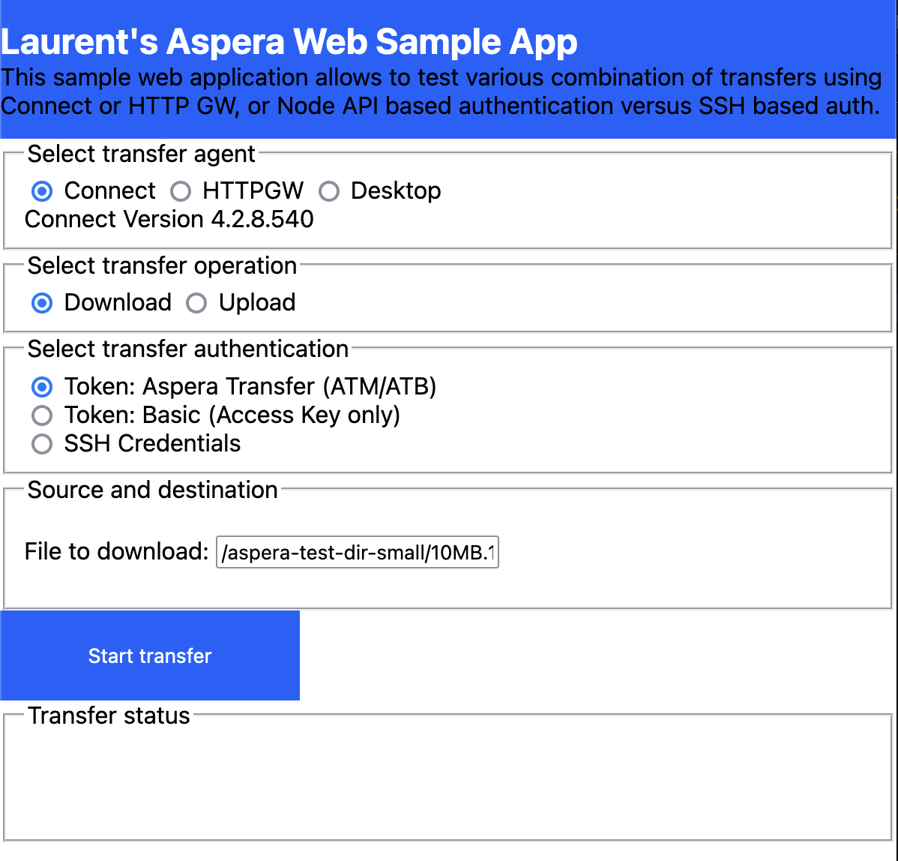
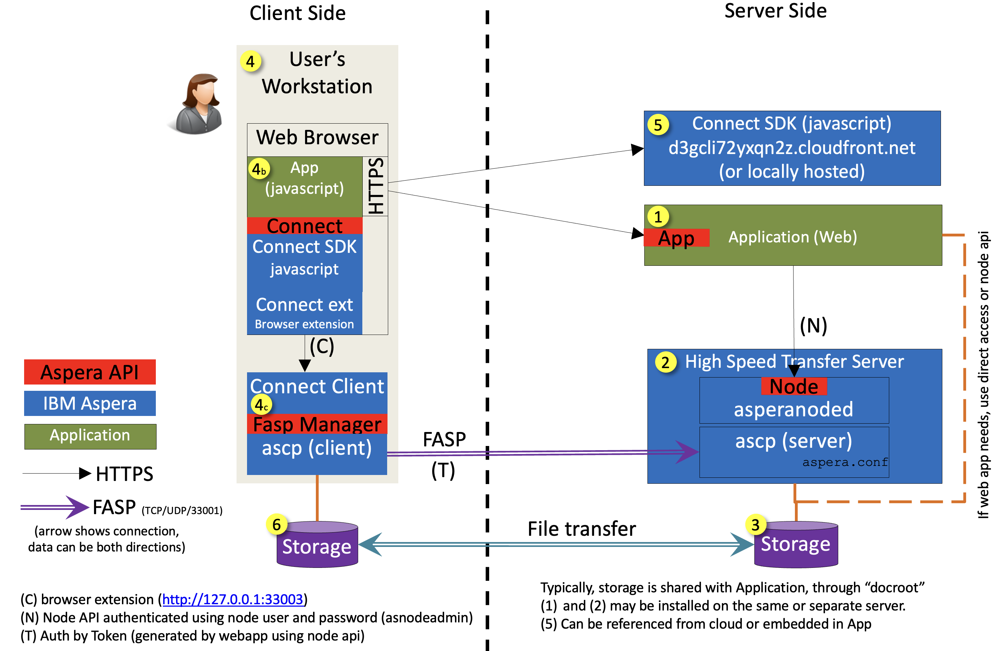
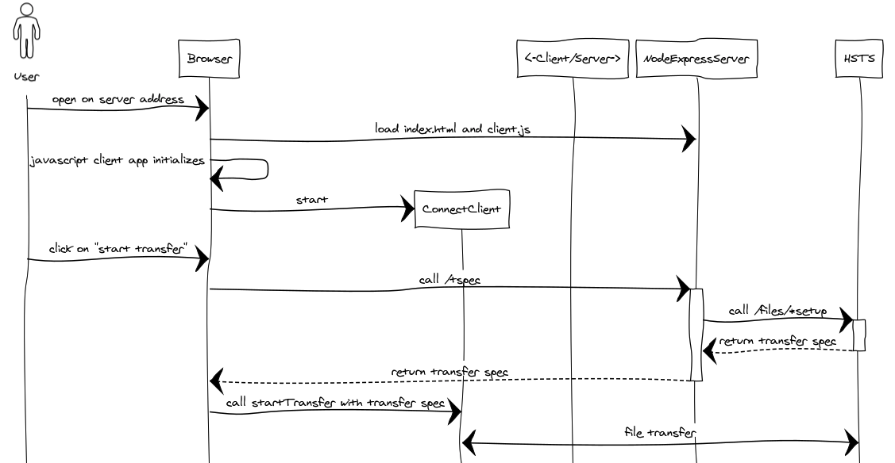

# Aspera transfers in Web Applications

## References

The current SDK for web app development is located at:

[web SDK repo](https://github.com/IBM/aspera-sdk-js)

[web SDK running example](https://ibm.github.io/aspera-sdk-js)

[web SDK TypeDoc documentation](https://ibm.github.io/aspera-sdk-js/docs/)

[Migration guide from the former SDKs](https://github.com/IBM/aspera-sdk-js/blob/main/MIGRATION.md)

[All Aspera APIs here](https://developer.ibm.com/apis/catalog?search=aspera)

## This repo

This sample application shows how to build an Aspera-transfer-enabled web application using the unified Aspera web SDK.



Starting a transfer consists of building a **transfer spec**
and then calling the browser-side JavaScript `startTransfer` API.

The transfer spec is Aspera's structure that contains all information to start a transfer:

- The HSTS server address, TCP method (SSH or HTTPS), TCP and UDP ports.
- Authorization (token, SSH key or password, etc.)
- Transfer direction, source files and destination folder
- Optional parameters such as resume policy, target rate, etc.

An Aspera transfer is authorized either:

- using a token (use this in web apps)
- using SSH credentials (mostly legacy or server-server transfers)

> [!NOTE]
> The SSH-based transfer authorization is not recommended for web applications,
> as users shall be authorized through the web app.
> The legacy Aspera "Connect Server" web app used SSH authentication, but is deprecated.

Web applications shall use the "token" authorization scheme, with one of these types:

- Aspera Transfer token (a string that starts with either `ATM` or `ATB` and ends with the same letters reversed)
- OAuth 2.0 bearer token (a string that begins with `Bearer`)
- Basic token (a string that begins with `Basic`, mainly for testing purposes, available only with access keys)

In this example, the transfer spec is built either:

- Using a broker app (server) which in turn calls the HSTS node API
  - it generates an Aspera Transfer token: this is the recommended way, or
  - it uses a Basic token (for testing purposes only, do not use this in web apps)
- Using SSH credentials (do not do that: for testing purposes only): in that case, the HSTS Node API is not used,
  but the SSH user's credentials must be known, and that transfer user must be authorized on the HSTS server without a token.
  For example, this is not possible on AoC/ATS SaaS Aspera transfer servers.



The web application is split into two parts:

- [`src/client/client.ts`](src/client/client.ts) runs in the browser, loaded by the main application page [`index.html`](index.html)
- [`src/server/server.ts`](src/server/server.ts) runs in Node.js and is called by the client. It calls the Node API of HSTS.



## Configuration

Refer to [the configuration section of the upper README.md](../README.md#configuration-file) to create `config.yaml`.

This sample app uses these values from the config file (`config.yaml`):

```yaml
web:
  port: 9080
node:
  url: https://node.example.com:9092
  verify: false
  username: _node_user_here_
  password: _node_pass_here_
server:
  url: ssh://eudemo.asperademo.com:33001
  username: _server_user_here_
  password: _server_pass_here_
  file_download: /aspera-test-dir-small/10MB.1
  folder_upload: /Upload
httpgw:
  url: https://mygw.example.com/aspera/http-gwy
```

> [!NOTE]
> Node credentials can be either a node user or an access key.
> As the use of SSH credentials is not recommended,
> you may leave `server.url`, `server.username` and `server.password` empty:
> `server.file_download` and `server.folder_upload` pre-fill the file to download and the upload folder.
> The `httpgw` section can also be ignored if you do not want to use HTTP Gateway.

<!-- separate alerts -->

> [!CAUTION]
> This sample app shares the full configuration with the client, including credentials.
> This is for demonstration only: in a real app, such secrets shall not be exposed.

## Environment Setup

The server uses [Node.js](https://nodejs.org/) (20.19+ or 22.12+, required by Vite 7).
Install it.
Check the version with:

```bash
node --version
```

## Execution of server, automated

For an automated run, using `make` and the `Makefile` (refer to it), do:

```bash
make run
```

> [!NOTE]
> The `Makefile` installs the Aspera web SDK library (`@ibm-aspera/sdk`) with `npm install`.

If you do not have `make`, refer to the `Makefile` for the startup procedure:

- Install the Node.js packages:

  ```bash
  npm install
  ```

- Run the `express` web server and `vite`:

  ```bash
  npm run all
  ```

## Using the application

Once the runtime is started:

- `express` serves the API on port `9080` (`web.port` in `config.yaml`)
- `vite` serves the client app and works as a reverse proxy for the server API, on port `5173` (`server.port` in `vite.config.ts`)

Use `vite`'s URL in the browser: <http://localhost:5173>

Select the transfer client: IBM Aspera for Desktop, IBM Aspera Connect, or HTTP Gateway.
The client app connects to it and shows its status and version.

Select the direction of the transfer: Download or Upload.

Select the type of authorization.
Typically, the "Aspera Transfer token" type is used.
But the sample app also shows how to use other types of transfer authorization.

For download, provide the path on the server; for upload, select local files and the destination folder.

Then start the transfer.

The status of the transfer can be followed on the web page.
