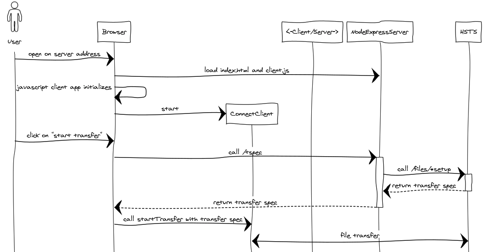

# Aspera transfers in web app using Connect or HTTP Gateway and Node API

This sample application shows how to build an Aspera-transfer-enabled web application using the Aspera Connect SDK and Aspera HTTP Gateway SDK.

In both case, starting a transfer consists in building a **transfer spec** and then calling the browser-side javascript `startTransfer` SDK's API.

The transfer spec is Aspera's structure that contains all information to start a transfer:

- the HSTS server address, TCP method (SSH or HTTPS), TCP and UDP ports
- authorization (token, ssh key or password, etc...)
- transfer direction, source files and destination folder
- optional parameters such as resume policy or target rate ,etc...

An Aspera transfer is authorized either:

- using a token (use this in web apps)
- using SSH credentials (mostly legacy or server-server transfers)

> **Note:** The SSH-based transfer authorization is not recommended for web applications, as users shall be authorized through the web app. The legacy Aspera "Connect Server" web app was using SSH auth, but is deprecated.

Web applications shall use the "token" authorization scheme, using either of those types:

- Aspera Transfer token (a string that starts with either `ATM` or `ATB` and ends with the same letters reverse)
- an OAuth 2.0 bearer token (a string that begins with `Bearer`)

In this example, the transfer spec is build either:

- Using a broker app (server) which in turn calls the HSTS node API
  - it generates an Aspera Transfer token : this is the recommended way
  - or it uses a Basic token (for testing purpose only, do not use this in web apps)
- Using SSH credentials (do not do that: for testing purpose only) : in that case, HSTS node api is not used, but SSH user's credentials must be known, and that transfer user must be authorized on the HSTS server without token. For example this is not possible on AoC/ATS SaaS Aspera transfer servers.

The web application is split in two parts:

- <src/client.js> runs in the browser, loaded by the main application page <src/index.html>
- <src/server.js> runs in nodejs and is called by the client. It calls the Node API of HSTS.



## Configuration

Refer to [the configuration section of the upper README.md](../README.md#configuration-file) to create `../config.yaml`.

This sample app uses these values from the config file (`../config.yaml`):

```yaml
node:
    url: https://server.example.com
    user: _node_user_here_
    pass: _node_pass_here_
server_paths:
    file_download: /aspera-test-dir-small/10MB.1
    folder_upload: /Upload
server:
    url: ssh://eudemo.asperademo.com:33001
    user: _server_user_here_
    pass: _server_pass_here_
httpgw:
  url: https://mygw.example.com/aspera/http-gwy
```

> **Note:** Node credentials can be either a node user, or an access key. As use of SSH credentials is not recommended, you may ignore the `server` section. The `httpgw`can also be ignored if you do not want to use HTTP GW.

## Environment Setup

The server uses [nodeJS](https://nodejs.org/) (v>=17, with `fetch`).
Install it.
Check version with:

```bash
node --version
```

## Execution of server, automated

For an automated run, using `make` and the `Makefile` (refer to it), do:

```bash
make
```

This will:

- install nodejs packages for the server
- download the http gateway client SDK
- generate the client config file `src/conf.js` from YAML
- run the express web server.

## Execution of server, manual

If you do not have `make`, you may refer to the `Makefile` for the procedure:

- install nodejs packages for server

  ```bash
  npm install
  ```

- start the server

  ```bash
  node --trace-warnings src/server.js ../config.yaml 3000 src/
  ```

> **Note:** In addition to this the `Makefile` installs the HTTP GW SDK library.

## Using the client

Once the server is started, it shall display the URL of the server, which shall be: <http://localhost:3000>

The client app proposes various cases, using connect versus HTTP GW.
For those two it will try to connect and retrieve the version.

Select the direction of transfer, Download or Upload.

Select the type of authorization.
Typically, the "Aspera Transfer token" type is used.
But the sample app also shows how to use other types of transfer authorization.

For download, provide the path on server, for upload select local files and destination folder.

Then start the transfer.

The status of transfer can be followed on the web page.

## References

[Aspera Connect Sample code](https://github.com/IBM/aspera-connect-sdk-js)

[Aspera Connect API Reference](https://ibm.github.io/aspera-connect-sdk-js/)

[Aspera HTTP GW SDK documentation](https://developer.ibm.com/apis/catalog?search=%22aspera%20http%22)

[Aspera Connect SDK documentation](https://developer.ibm.com/apis/catalog?search=%22aspera%20connect%22)

[All Aspera APIs here](https://developer.ibm.com/apis/catalog?search=aspera)
